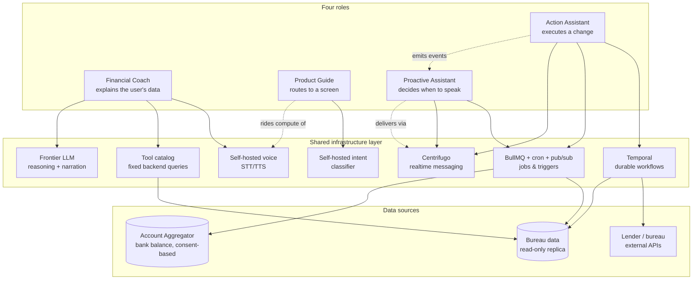
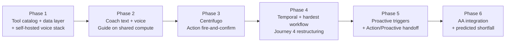

# GoodScore AI Assistant — Product & Business Architecture

> **System thesis:** One assistant, four roles, one shared infrastructure layer, one governing constraint. Every component is self-hosted/deterministic by default — paid APIs, generative reasoning, and frontier-model usage are each earned only where the cheaper or safer alternative genuinely breaks, never assumed.

---

## 1. The problem

GoodScore's users are not typical fintech users. Per the founder's own description: people who took on six to seven loans and credit cards over time, went through a real financial shock, defaulted on two or three of those obligations, and are now actively trying to recover. They are credit-active but financially stressed, often first-time or low-literacy users of formal credit systems, and — critically for this design — often on secondhand or entry-tier devices, because they are frequently single earners managing a household through recovery.

A generic AI chatbot fails this user in a specific, predictable way: it answers questions but doesn't *act*, it explains in jargon instead of plain language, it interrupts when convenient for the business rather than when useful for the user, and it asks the user to repeat context the system should already know. GoodScore's AI assistant is deliberately not one chatbot — it's four distinct roles, each solving a different shape of problem for the same underlying user.

---

## 2. The constraint that governs everything

GoodScore charges **₹100/month, mandatory autopay at registration**, against **5 million MAU**. That looks like a comfortable budget — until the real number is checked.

```
Theoretical ceiling (100% of 5M MAU paying):     ₹50 Cr / month
Actual reported revenue (FY25):                  ₹52.1 Cr / YEAR  →  ~₹4.34 Cr / month
```

**The real budget being protected is roughly 12x smaller than the headline number suggests.** Every cost-sensitive decision across all four roles was pressure-tested against ₹4.34 Cr/month, not ₹50 Cr/month — this single correction is why "use the best available model or API for everything" was never on the table for any role, and why self-hosted/open-source infrastructure shows up as the default posture throughout this system rather than an afterthought.

Two roles are governed by an additional constraint layered on top of revenue:
- **Product Guide** is also constrained by GoodScore's real device fleet — secondhand or entry-tier Android, 2–4GB RAM — which rules out on-device inference regardless of cost.
- **Proactive Assistant** is also constrained by regulatory and platform viability — Google Play's SMS-permission policy rules out the brief's own proposed data-access mechanism regardless of cost.
- **Action Assistant** is governed by a different kind of constraint first: correctness of financial and legal state, where the cost of getting it wrong isn't a bad experience, it's a double charge or a conflicting lender negotiation.

---

## 3. Shared system architecture



**The single most important thing to take from this diagram:** none of the four roles talk to data sources or external systems directly. Every role goes through a shared infrastructure layer, and that sharing is deliberate — it's what lets Guide ride Coach's GPU footprint at near-zero marginal cost, and what turns Centrifugo from "something Action Assistant needed" into system-wide messaging infrastructure Proactive also depends on.

---

## 4. The four roles

### 4.1 Financial Coach

**What it does:** Explains the user's own credit data in plain, trustworthy language — the role that turns a confusing bureau report into something a financially stressed, low-literacy user can actually act on.

| Journey | Trigger | What Coach does |
|---|---|---|
| 1. First report view | User sees a score for the first time | Factor-by-factor breakdown of *why* the score is what it is |
| 2. Score change | New bureau pull moves the score | Causal explanation — what specifically changed, and why |
| 3. Unknown lender name | User sees "Axio" / "Arthimpact" on report | Instant trust-repair: maps the name to the fintech app they recognize |
| 4. Utilization confusion | User told "reduce utilization," doesn't know why it matters | Personalized mechanism explainer using their actual card and number |
| 5. Progress check | Weeks/months into recovery | Retention moment — "3 months ago you were at 642, today you're 670" |
| 6. Jargon | First-time credit users, zero literacy | Plain-language glossary baked into every explanation |

**Sharpest decisions:**
- **Deterministic tools, not Text-to-SQL** — the LLM never generates a query against real financial data; it calls fixed, pre-tested backend functions. A hallucinated join in most products is a bug; here it's a trust-ending event.
- **Self-hosted voice, not managed API (Sarvam)** — GoodScore's realistic volume sits 38×–455× past the self-hosted breakeven point, even under conservative engagement assumptions.
- **Template video by default, personalized video earned** — true AI-personalized video is reserved for one high-value moment (the quarterly progress recap), because even the cheap self-hosted option breaks the business at monthly frequency.

**The one number:** at 15% Coach engagement, a managed voice API alone would consume ~26% of real monthly revenue. Self-hosted brings the same capability to under 1%.

---

### 4.2 Product Guide

**What it does:** Gets the user to the right screen, fast — without ever needing to reason about their financial data.

| Journey | Trigger | What Guide does |
|---|---|---|
| 1. Direct navigation | User knows what they want, not where it lives | Natural language → deep link, straight to the screen |
| 2. In-flow assistance | User is mid-task and hits a confusing field/step | Context-aware help using the screen the user is currently on |
| 3. Capability discovery | User doesn't know a feature (AutoPay, reminders) exists | Light, behavior-triggered nudges — rare, earned, never spam |
| 4. Friction recovery | User hits an error or can't find what they need | One clarifying attempt, then deterministic handoff to search/support |
| 5. First-time onboarding | User opens the app for the first time | Scripted welcome + guided tour offer |

**Sharpest decisions:**
- **Server-side classification, not on-device** — GoodScore's actual device fleet (2–4GB RAM, secondhand/entry-tier Android) cannot reliably free the RAM even small on-device models need. This was a direct correction after the device-fleet reality was raised — "on-device is viable in 2026" is true for flagship devices, not for GoodScore's actual users.
- **Standard deep linking, not a custom routing layer** — Guide's only real engineering surface is "intent → deep link string," handed to the app's existing router.
- **Shared compute, not standalone provisioning** — Guide's classifier rides Coach's already-justified GPU footprint rather than becoming a new infrastructure line item.

**The one number:** Guide is the only role in this system with no standalone cost line — its entire economics rest on one design choice (reuse, don't reprovision).

---

### 4.3 Proactive Assistant

**What it does:** Tells the user what matters before they think to ask — without becoming the reason they mute notifications or uninstall.

| Journey | Trigger | What Proactive does |
|---|---|---|
| 1. Score change | New bureau pull moves the score | Push notification on score-delta detection, surfacing the causal explanation as soon as the user opens the app |
| 2. Bill due | Known due date approaching | Scheduled reminder with one-tap pay/remind action |
| 3. Utilization threshold | Bureau data crosses 75% utilization | Threshold-triggered alert surfacing what's driving the spike |
| 4. Predicted shortfall | Bank balance trend suggests an EMI is at risk | Predictive shortfall alert — the journey with the hardest open questions in this role |
| 5. SLA breach | Bureau dispute open 30+ days | Automatic compensation claim + Ombudsman escalation path |

**Sharpest decisions:**
- **Account Aggregator, not SMS parsing** — the brief's own proposed mechanism for predicting shortfalls (parsing user SMS) is very likely non-viable: Google Play requires default-SMS-handler status to even request the permission, and GoodScore is a credit app, not an SMS app. Replaced with India's RBI-regulated, consent-first Account Aggregator framework.
- **Zero LLM in the trigger path** — all five journeys reduce to detect-and-template. Detection is rule/threshold checks or simple statistical trend projection; the message is a filled-in sentence, not generated prose.
- **A notification arbiter, not an unlimited trigger-to-message pipeline** — daily cap, priority ranking, and per-type cooldown sit between "conditions are true" and "what's actually sent." Arguably the single most important piece of this role.
- **Never mid-session** — a nudge only ever surfaces as a push (app closed) or at the moment the app opens, never injected into an active task elsewhere in the app.

**The one number:** this is the cheapest role in the system to run — nothing in it scales dangerously with MAU; the entire cost profile is fixed infrastructure plus a bounded Account Aggregator integration cost.

---

### 4.4 Action Assistant

**What it does:** Actually does the thing — negotiates the restructuring, files the dispute, closes the account — not just explains the problem.

| Journey | Trigger | What Action Assistant does |
|---|---|---|
| 1. Set reminder / AutoPay | User wants a bill reminder or AutoPay turned on, no waiting | A single synchronous action — one API call, confirmed immediately |
| 2. Pay bill / EMI now | User wants to pay right now, through the app | A payment action with gateway confirmation; first journey where idempotency genuinely matters |
| 3. Raise a bureau dispute | User flags a wrong entry on their report | A long-running, multi-phase process: file → awaiting bureau response → resolved, trackable over days/weeks |
| 4. Restructure an at-risk EMI | User is going to miss an EMI and needs new terms | The hardest journey in this role — checks affordability, proposes terms, requires user confirmation mid-flow, submits to the lender, and locks out conflicting requests for the same loan |
| 5. Apply for a loan | User wants a new loan from GoodScore's marketplace | Eligibility → offer selection → KYC → submission → lender decision, with multiple user-facing checkpoints |
| 6. Close a loan / credit card | User wants to close an account | Direct closure if no balance, or forks into a Journey-4-style settlement negotiation if one exists |

**Sharpest decisions:**
- **Two infrastructure paths, not one** — fire-and-confirm journeys (1-2) run on a simple queue (BullMQ); long-running, multi-phase, externally-dependent journeys (3-6) run on a durable workflow engine (Temporal). A plain queue's contract stops at "a worker received this job" — it says nothing about surviving a crash mid-negotiation without double-submitting to a lender.
- **Two idempotency guarantees, not one** — a request-level idempotency key (catches retried network requests) and a separate business-entity lock keyed to the loan/account itself (catches two genuinely different, individually-valid requests for the same loan).
- **Self-hosted realtime messaging (Centrifugo)** — bare-metal WebSockets fail on reliability at this scale (65% of DIY implementations hit significant downtime); managed SaaS fails on cost (10-50%+ of real revenue depending on tier).
- **Workflows never push a screen directly** — a paused workflow emits an event; Proactive Assistant owns all delivery-timing decisions, so a restructuring confirmation never interrupts an unrelated task elsewhere in the app.

**The one number:** this role's cost story is shaped differently from the other three — fixed infrastructure (Temporal, Centrifugo), justified once, not a per-conversation or per-token line item that scales with MAU.

---

## 5. Cross-cutting architectural principles

The same underlying discipline produced four different concrete architectures, because each role's actual constraint was different. Four patterns recur across all of them:

**1. Deterministic over generative, wherever correctness matters.** Coach's tool catalog instead of Text-to-SQL; Proactive's rule/threshold detection instead of LLM-based risk assessment; Action's workflow-ID-derived locking instead of trusting an idempotency key alone. The principle: never ask a generative system to do something a deterministic one can do more reliably, especially when the output touches a number the user will trust.

**2. Self-hosted by default, paid/managed as an earned exception.** Voice (Coach), messaging (Action/Proactive), and intent classification (Guide) are all self-hosted — not because open-source is a preference, but because the real revenue number makes paid-API-at-scale fail the same way in every case it was checked.

**3. Narrow scope beats frontier capability for narrow jobs.** Guide's small classifier instead of a frontier LLM for navigation; Proactive's zero-LLM trigger detection. The pattern: match the model to the job's actual difficulty, not to what's technically most capable.

**4. Restraint is a design feature, not an afterthought.** Proactive's notification arbiter and Action's hand-off-to-Proactive-rather-than-push-directly both encode the same idea: deciding *when not to act* is as much a part of the architecture as deciding what to build.

---

## 6. Total cost summary

*(against real revenue of ~₹4.34 Cr/month)*

| Role | Component | Approach | Cost shape |
|---|---|---|---|
| Coach | Voice (STT/TTS) | Self-hosted | <1% of revenue |
| Coach | Video — template library | One-time CapEx | ~0% recurring |
| Coach | Video — personalized recap | Self-hosted, quarterly only | Low single digits |
| Coach | LLM reasoning | Frontier API, narrow tool-calling use | Watched against a 5M tokens/day self-host trigger |
| Guide | Intent classification | Shared compute with Coach | ~0% — not separately costed |
| Guide | Navigation/routing | Standard deep linking | ~0% — reuses existing infra |
| Proactive | Trigger detection | Rule/threshold/stats, zero model calls | ~0% marginal |
| Proactive | Account Aggregator integration | Fixed integration cost | Low, bounded — not per-user |
| Action | Real-time messaging | Self-hosted Centrifugo | Fixed, shared across roles |
| Action | Durable workflows | Self-hosted Temporal | Fixed — scales with workflow types, not MAU |

**The pattern holding across every role:** self-hosted/open-source/deterministic by default, paid or generative only where a specific, named alternative was checked and shown to fail — on cost, on reliability, or on regulatory grounds. Not a stated preference; in every case checked, close to a hard requirement at this revenue base.

---

## 7. Build sequencing across all four roles



1. **Tool catalog + data layer + self-hosted voice** — the foundation every later phase depends on.
2. **Coach (text-first, then voice) + Guide riding the same compute** — proves the core reasoning loop and the shared-infrastructure pattern early, while it's cheapest to course-correct.
3. **Centrifugo + Action's simple journeys** — establishes messaging before any role needs live delivery; proves the simple half of Action Assistant before the hard half.
4. **Temporal + Action's hardest journey (EMI restructuring)** — tackled first among long-running journeys because it exercises every pattern (mid-flow confirmation, external-party wait, locking) the rest reuse.
5. **Proactive's triggers + the Action→Proactive handoff** — depends on Action already emitting events correctly and on bureau-data event publishing existing.
6. **Account Aggregator integration + predicted shortfall** — intentionally last: AA onboarding has real regulatory lead time independent of engineering velocity, and shortfall prediction carries the highest false-positive risk in the system.

---

## 8. Open risks, consolidated

| Risk | Affects | Why it matters |
|---|---|---|
| Open-source Indic ASR/TTS accuracy on real (noisy, code-mixed) user audio is unverified | Coach, Guide | Published benchmarks aren't a substitute for testing on GoodScore's actual call patterns |
| Real engagement/volume numbers are industry-benchmark estimates, not measured | Coach | Every cost projection should be re-run once production telemetry exists |
| Device fleet assumption (2–4GB RAM) is inferred from income/pricing data, not measured | Guide | Worth confirming against actual install-base telemetry before fully closing the door on on-device |
| Account Aggregator integration has real regulatory lead time | Proactive | FIU registration and AA partner onboarding is a business process, not a pure engineering task |
| Notification cap/cooldown thresholds are design intent, untested | Proactive | Needs real engagement data to avoid both under- and over-notifying |
| Temporal operational overhead is real and not yet sized | Action | A genuine new ops investment for the team, distinct from anything the other roles require |
| Action → Proactive coupling is a new cross-role dependency | Action, Proactive | Needs a clear contract so a failure in one role's delivery logic doesn't silently strand the other's event |

---

## 9. What this buys GoodScore

A single AI assistant that behaves like four specialists instead of one generalist — one that explains a user's credit data in language they trust, gets them to the right screen without friction, tells them what matters before they have to ask, and actually executes the hard financial actions (restructuring, disputes, closures) end to end, correctly, even when that takes days or weeks and survives a server crash along the way.

Built on a single shared infrastructure layer rather than four independent stacks, which is what makes the unit economics work at GoodScore's real ~₹4.34 Cr/month revenue rather than the ₹50 Cr ceiling the headline number suggests — and built with deterministic, self-hosted defaults wherever correctness or cost discipline mattered more than raw model capability, so the system is cheap to run and hard to make confidently wrong about a user's money.
