# GoodScore AI Assistant — High-Level Design

> **System thesis:** One assistant, four roles, one shared infrastructure layer, one governing constraint. Every component below is self-hosted/deterministic by default — paid APIs, generative queries, and frontier-model reasoning are each used only where the alternative breaks at GoodScore's real revenue (~₹4.34 Cr/month, not the ₹50 Cr theoretical ceiling) or fails on correctness/regulatory grounds.

---

## 1. System overview

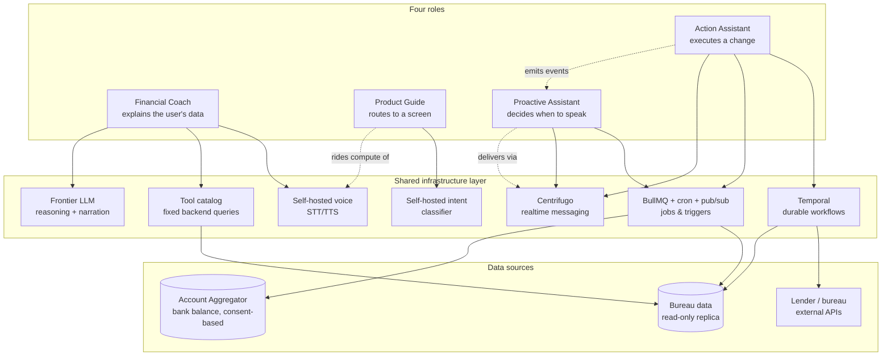

**Reading this diagram:** the four roles never talk to data sources or external systems directly — every role goes through the shared infrastructure layer, and that layer is what touches bureau data, bank data, and lenders. This is deliberate: it's the same pattern that let Guide ride Coach's GPU footprint and let Action's Centrifugo become system-wide messaging rather than an Action-only cost.

---

## 2. The governing constraint

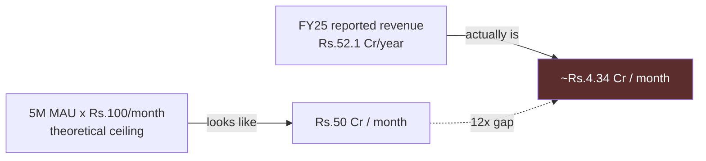

Every cost-sensitive decision in this document is pressure-tested against **₹4.34 Cr/month**, not the ₹50 Cr figure the headline numbers suggest. This single correction is why "use the best available model/API for everything" was never viable for any role.

Two roles are shaped by a different constraint first, layered on top of the revenue one:
- **Product Guide** — the actual device fleet GoodScore's users carry (2–4GB RAM, secondhand/entry-tier Android), which rules out on-device inference regardless of cost.
- **Proactive Assistant** — regulatory/platform viability (Google Play SMS-permission policy), which rules out the brief's own proposed data-access mechanism regardless of cost.
- **Action Assistant** — correctness of financial/legal state, which reframes "cheap" to mean "cheap without hand-rolling guarantees real infrastructure already provides."

---

## 3. Shared infrastructure layer — component detail

### 3.1 Self-hosted voice stack

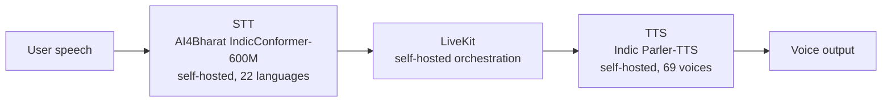

- **Provider decision:** Sarvam (managed API) evaluated and rejected for steady-state use — self-hosted breakeven sits at ~22K–43K sessions/month on a single GPU instance; GoodScore's realistic volume is 38×–455× past that breakeven even under conservative engagement assumptions.
- **Orchestration:** LiveKit chosen over Pipecat — not because of call-shape fit (Pipecat's leaner 1:1 design was the "obvious" pick) but because LiveKit ships interruption-handling, connection management, and a ready-made human-handoff pattern already built and maintained, trading some architectural elegance for materially faster shipping and lower long-term maintenance burden.
- **Owner role:** Financial Coach. **Shared by:** Product Guide's intent classifier rides the same GPU footprint.

### 3.2 Tool catalog (deterministic data layer)

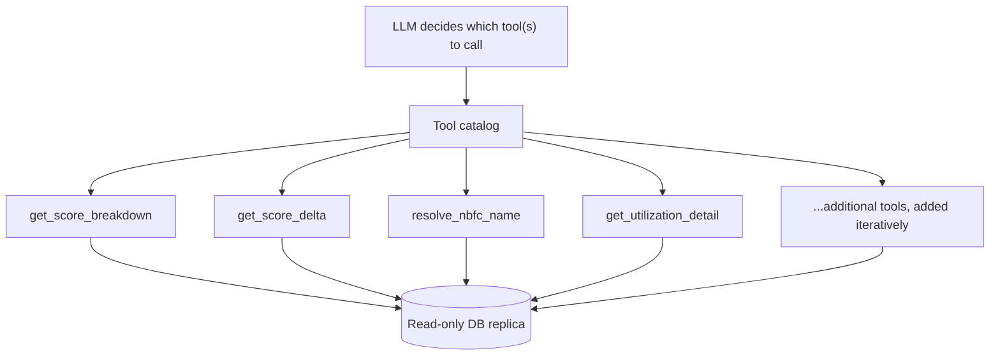

- **Core decision:** Text-to-SQL (Gemini's original proposal) rejected outright — even high-accuracy generative query systems occasionally hallucinate a join or misfilter, which is an acceptable bug in most products but a trust-ending event in this one (an incorrect number about a user's own debt). Replaced with a catalog of fixed, pre-tested backend functions exposed to the LLM as callable tools.
- **Chaining behavior:** "what" journeys (e.g. score breakdown) call one tool and stop. "why" journeys (e.g. why did my score change) chain multiple tools in sequence, inspecting each result before deciding the next call — this is why the orchestration layer needs LangGraph's stateful loop, not a one-shot pipeline.
- **Owner role:** Financial Coach. **Conceptually reused by:** Action Assistant's tool-facing API layer (`start_emi_restructuring(loan_id)` etc.) follows the same thin-tool-layer principle.

### 3.3 LLM reasoning layer

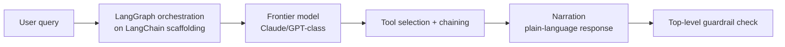

- **Model choice:** paid frontier model now, not self-hosted — self-hosting only wins past ~5M tokens/day sustained volume, which is not yet measured; tool-calling reliability also matters more here than raw chat quality, and frontier models are more dependable specifically at structured function-calling.
- **Migration trigger:** explicit and measurable — once production telemetry shows sustained volume crossing 5M tokens/day, re-evaluate self-hosting. Not a vague someday plan.
- **Framework:** LangGraph (orchestration/state) on top of LangChain (tool/integration scaffolding) — required because tool-chaining for "why" journeys is stateful and branching, not a fixed sequence.
- **Owner role:** Financial Coach. **Used narrowly by:** Action Assistant (deciding which workflow tool to start; not owning multi-step business logic).

### 3.4 Centrifugo — realtime messaging layer

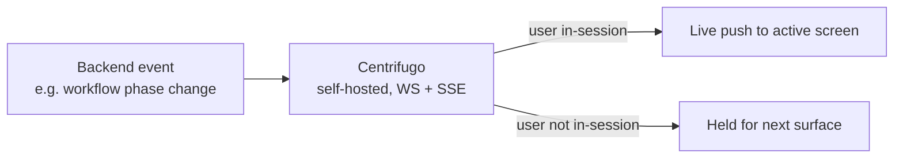

- **Rejected alternatives:** bare-metal hand-rolled WebSockets (65% of DIY implementations hit significant downtime; ~10.2 person-months to build in-house; ~$100K–200K/year upkeep for roughly half of self-built solutions) and managed SaaS (Ably — even at best-case volume pricing, the MAU base fee alone is ~10% of real monthly revenue, ~50%+ at standard rates, before connection-minutes/message/bandwidth charges).
- **Verdict:** self-hosted Centrifugo — open-source, benchmarked at 1M WebSocket connections and 30M messages/minute on a single modern server, natively supports both WebSocket and SSE from one server.
- **Owner role:** Action Assistant (where the need was first identified). **Now system-wide shared infrastructure** — Proactive Assistant's delivery layer rides this same service.

### 3.5 Temporal — durable workflow engine

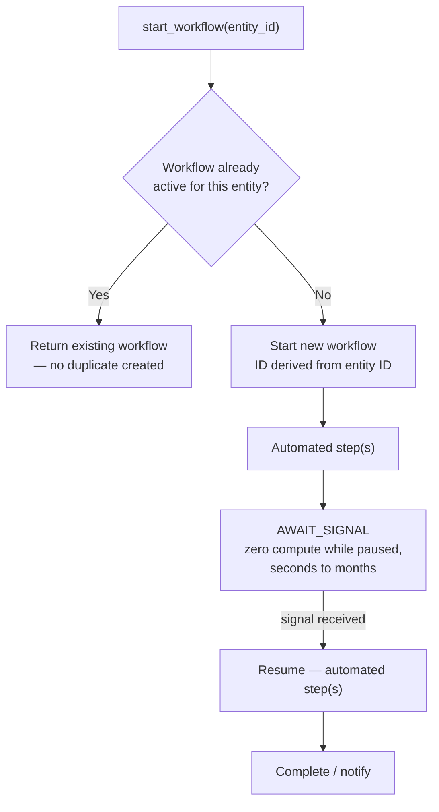

- **Rejected alternative:** a single job queue (BullMQ/Redis) for every Action Assistant journey. A queue's contract is "a worker received this job" — it says nothing about whether a 6-phase process survived a crash on phase 3 without re-submitting to an external party. Compensating by hand (manual progress tracking, custom status tables, bespoke recovery scripts) is more total engineering effort than adopting a durable execution engine correctly.
- **Idempotency model:** two layers, not one — (a) request-level idempotency keys (UUID per call, catches retried network requests) and (b) business-entity locks (workflow ID derived from the entity being acted on, catches two *different*, individually valid requests for the same entity — e.g. two different restructuring proposals for the same loan).
- **Mid-process user input:** Temporal signals — a workflow can pause genuinely (zero compute) for an unbounded duration and resume exactly where it stopped when a signal arrives. The workflow's own phase is the single source of truth for which screen the frontend renders; there is no separate frontend state machine.
- **Owner role:** Action Assistant only (Journeys 3–6: disputes, restructuring, loan applications, closures). Journeys 1–2 (reminders, instant payments) use the simpler BullMQ path.

### 3.6 BullMQ + cron + pub/sub — simple jobs and triggers

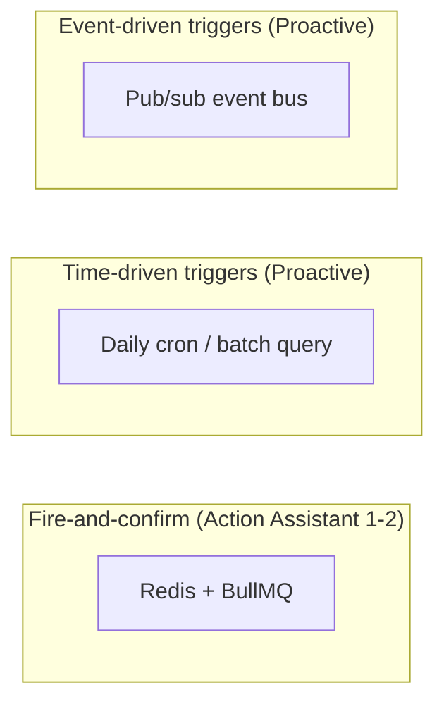

- **BullMQ scope:** strictly Action Assistant Journeys 1–2 (set reminder/AutoPay, pay bill now) — short-lived, single-step, crash-safe-by-restart is acceptable here.
- **Cron scope:** Proactive's calendar-predictable checks (bill due in N days, dispute SLA at 30 days) — one daily indexed batch query per check across the full user base, not a per-user job.
- **Pub/sub scope:** Proactive's reactive checks (score change, utilization threshold, AA balance update) — the ingesting service (bureau pipeline, AA integration) publishes an event the moment new data arrives; Proactive subscribes, avoiding polling the entire user base.

---

## 4. Role-level architecture

### 4.1 Financial Coach

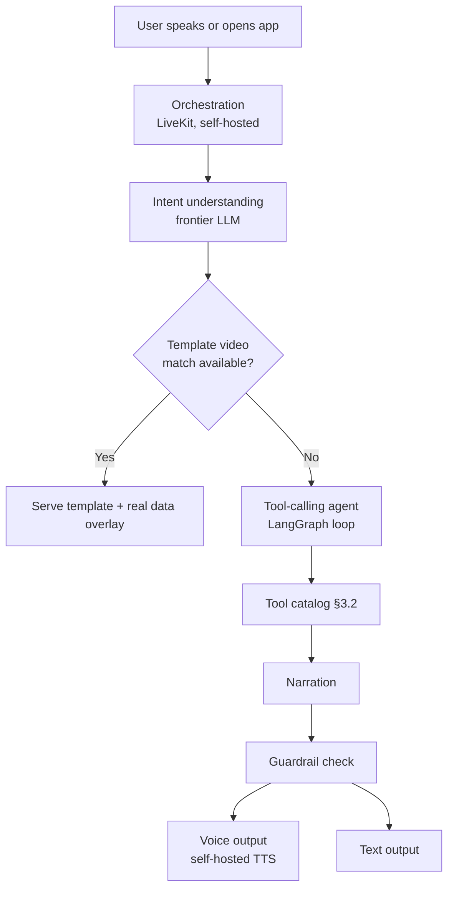

- **Video strategy:** template library (covers score-band x dominant-factor x language combinations) as default; true AI-personalized video (script → TTS → Wav2Lip lip-sync, self-hosted) reserved for one high-value moment only — the quarterly progress recap — because even the cheap self-hosted avatar option breaks the business at monthly frequency (~56% of real revenue at 1 video/user/month).
- **6 journeys:** first report view, score change, unknown lender name, utilization confusion, progress check, jargon/glossary.

### 4.2 Product Guide

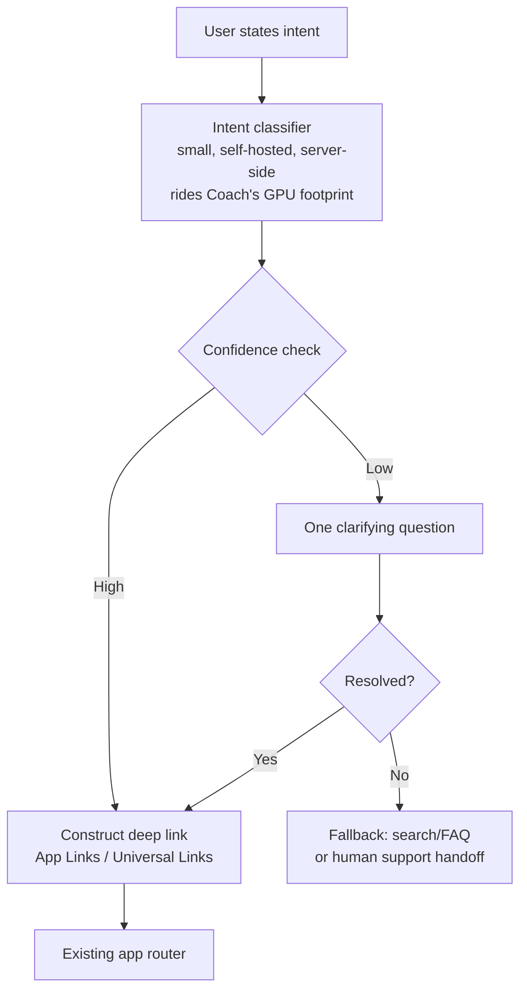

- **On-device inference explicitly rejected:** GoodScore's realistic device class (2–4GB RAM, secondhand/entry-tier Xiaomi/Redmi, heavy OS skin) cannot reliably free the ~4GB even small on-device models need. Server-side only in v1.
- **No custom routing layer:** standard deep linking only — Guide's only real surface area is "intent → deep link string."
- **5 journeys:** direct navigation, in-flow assistance, capability discovery, friction recovery, first-time onboarding.

### 4.3 Proactive Assistant

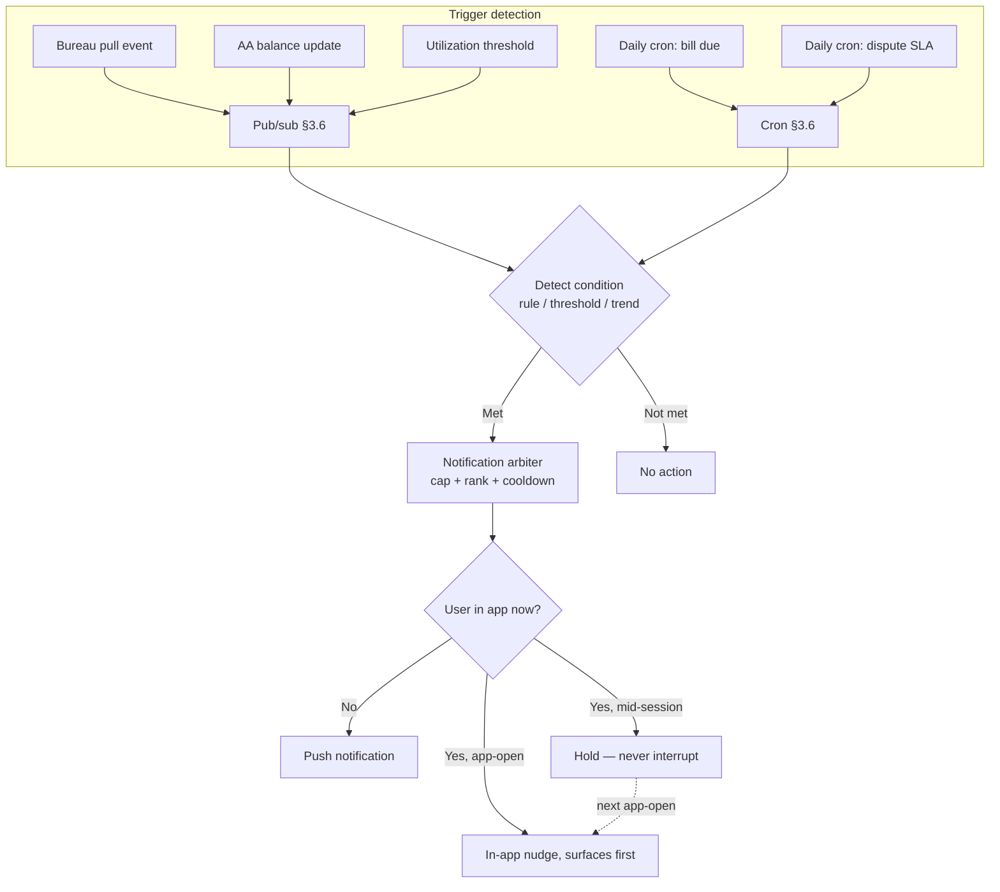

- **Bank data source:** Account Aggregator framework (RBI-regulated, consent-first, FIU registration), not SMS parsing as originally proposed — Google Play requires default-SMS-handler status to even request the READ_SMS permission, which is not realistic for a credit app and risks Play Store distribution eligibility entirely.
- **Zero LLM in the trigger path:** all five journeys reduce to detect → template. Detection is rule/threshold checks or simple statistical trend projection (moving average/regression for shortfall prediction); the message is a filled-in sentence, not generated prose.
- **Notification arbiter:** the single most important piece of this role — daily cap regardless of how many conditions are true, priority ranking (regulatory compensation always outranks a routine nudge), and per-type cooldown after a dismissed nudge.
- **5 journeys:** score change, bill due, utilization threshold, predicted shortfall, dispute SLA breach.

### 4.4 Action Assistant

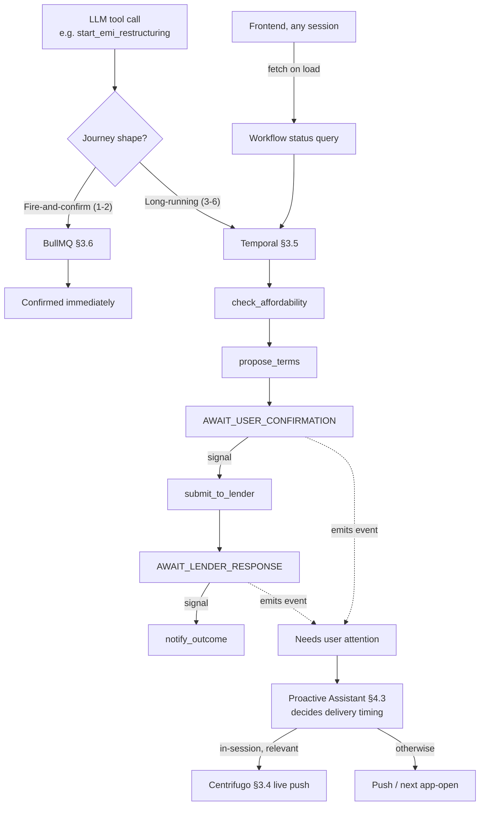

- **Two infrastructure paths by journey shape**, not one tool stretched to cover both — see §3.5 and §3.6.
- **A workflow never pushes a screen directly** — it emits an event; Proactive Assistant owns all delivery-timing decisions system-wide, consistent with §4.3.
- **Paused requests are backend entities**, addressable by loan/account ID — not something the user has to find by scrolling chat history. Chat is how a request gets created; it is not how it gets resumed.
- **6 journeys:** set reminder/AutoPay, pay bill now, raise dispute, restructure at-risk EMI, apply for loan, close loan/card.

---

## 5. Cross-role dependency map

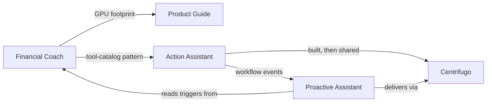

| Dependency | Direction | What's shared |
|---|---|---|
| Coach → Guide | Infrastructure | Self-hosted GPU footprint for the intent classifier |
| Coach → Action | Pattern | Thin-tool-layer principle (LLM picks tools, doesn't own multi-step logic) |
| Action → Proactive | Data flow | Workflow phase-change events, consumed by the notification arbiter |
| Action → Proactive | Infrastructure | Centrifugo, built for Action's needs, now system-wide |
| Proactive → Coach | Data flow | Bureau-data triggers (score delta, utilization) originate from the same data Coach's tools read |

**Why this matters operationally:** none of these four roles can be built in true isolation. Coach's infrastructure decisions (self-hosted voice, tool catalog) are load-bearing for Guide and Action. Action's infrastructure decisions (Centrifugo, the event-emission pattern) are load-bearing for Proactive. Build sequencing (§6) follows this dependency graph, not role-by-role convenience.

---

## 6. Build sequencing across all four roles

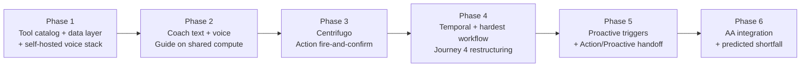

1. **Tool catalog + data layer + self-hosted voice** — the foundation every later phase depends on; nothing else can start meaningfully without it.
2. **Coach (text-first, then voice) + Guide riding the same compute** — proves the core reasoning/tool-calling loop and validates the shared-infrastructure pattern early, while it's cheapest to course-correct.
3. **Centrifugo + Action's simple journeys (BullMQ-based)** — establishes the messaging layer before any role needs live delivery, and proves the simple half of Action Assistant before the hard half.
4. **Temporal + Action's hardest journey (EMI restructuring)** — deliberately tackled first among the long-running journeys because it exercises every pattern (mid-flow confirmation, external-party wait, business-entity locking) the remaining journeys reuse.
5. **Proactive's rule/cron/pub-sub triggers + the Action→Proactive event handoff** — depends on Action already emitting events correctly (phase 4) and on bureau-data event publishing existing (phase 1-2).
6. **Account Aggregator integration + predicted shortfall** — intentionally last; AA onboarding has real regulatory lead time independent of engineering velocity, and shortfall prediction carries the highest false-positive risk in the whole system, so it ships once every other pattern is proven.

---

## 7. Consolidated open risks

| Risk | Affects | Why it matters |
|---|---|---|
| Open-source Indic ASR/TTS accuracy on real (noisy, code-mixed) user audio is unverified | Coach, Guide (shared compute) | Published benchmarks aren't a substitute for testing on GoodScore's actual call patterns |
| Real engagement/volume numbers (Coach session %, LLM tokens/day) are industry-benchmark estimates, not measured | Coach | Every cost projection in this system should be re-run once production telemetry exists |
| Device fleet assumption (2–4GB RAM) is inferred from income/pricing data, not measured | Guide | Worth confirming against GoodScore's actual install-base telemetry before fully closing the door on on-device |
| Account Aggregator integration has real regulatory lead time | Proactive | FIU registration and AA partner onboarding is a business process, not a pure engineering task — must start early |
| Notification cap/cooldown thresholds are design intent, untested | Proactive | Needs real engagement data to avoid both under- and over-notifying |
| Temporal operational overhead (cluster ops, deterministic-workflow discipline) is real and not yet sized | Action | A genuine new skill/ops investment for the team, distinct from anything the other three roles require |
| Action → Proactive coupling is a new cross-role dependency | Action, Proactive | Needs a clear contract so a failure in one role's delivery logic doesn't silently strand the other's event |

---

## 8. Summary

Four roles, one shared infrastructure layer, one governing economic constraint, and a consistent design philosophy applied differently per role based on what each role's specific risk actually is:

- **Coach** — cost discipline + trust-by-construction (deterministic tools over generative SQL)
- **Guide** — narrow scope + device-reality discipline (server-side over assumed-viable on-device)
- **Proactive** — regulatory discipline + restraint discipline (sanctioned data access, notification governance)
- **Action** — correctness discipline (durable execution and explicit locking over hand-rolled bookkeeping)

The same underlying principle — **don't reach for the expensive or the generative option until the cheap, deterministic, self-hosted option has been proven insufficient** — produced four different concrete architectures because each role's actual constraint was different. That's the system.
