# GoodScore AI Assistant — Technical Architecture
### System Design Document

---

## 1. Problem Statement & Scope

GoodScore serves millions of users seeking to understand and improve their financial health. The majority are first-time credit users with low financial literacy, unfamiliar with bureau terminology, on entry-tier Android devices, earning ₹25–40k/month.

A standard FAQ chatbot is insufficient for three reasons:

- **Data is personal and structured** — every meaningful answer requires querying the user's actual loans, scores, bills, and repayment history, not a generic knowledge base
- **Actions have real financial and legal consequences** — disputing a bureau entry, restructuring an EMI, or applying for a loan cannot be one-shot LLM outputs; they require durable, crash-safe multi-step execution
- **The system must speak first** — waiting for users to ask means missing the moments that matter most (score drops, upcoming dues, predicted shortfalls)

**System constraints that shape every decision:**

| Constraint | Impact |
|---|---|
| 5M MAU, ₹100/month paywall | Unit economics are thin; every infra cost is measured against ~₹4.34 Cr/month actual revenue |
| RBI data residency | All compute and storage on AWS Mumbai; no user financial data leaves India |
| Device fleet | Entry-tier Android (2–4GB RAM, MIUI/HyperOS); on-device inference is not viable |
| Regulatory compliance | AA framework for bank data, CICRA dispute SLA tracking, OTS rules, digital signature requirements |

---

## 2. System Architecture — HLD

### 2.1 System Architecture Overview

High-level component map. Shows all layers from the mobile client to the data tier and how they connect.

```mermaid
%%{init: {'theme':'dark', 'themeVariables': { 'darkMode':'true', 'background':'#1a1d23', 'primaryColor':'#42a5f5', 'primaryTextColor':'#e3e8ef', 'primaryBorderColor':'#42a5f5', 'lineColor':'#64b5f6', 'secondaryColor':'#5c6bc0', 'tertiaryColor':'#37474f', 'clusterBkg':'#252932', 'clusterBorder':'#546e7a', 'edgeLabelBackground':'#1a1d23', 'fontSize':'13px'}}}%%
graph TB
    subgraph FE["Frontend - React Native / Flutter"]
        ChatUI["Chat UI<br/>Bottom Sheet Overlay"]
        VoiceUI["Voice UI<br/>LiveKit WebRTC"]
        DeepLink["Deep Link Router"]
    end
    subgraph RealTime["Real-Time Channels"]
        Centrifugo["Centrifugo<br/>WebSocket / SSE<br/>Text | Workflow Updates | Nudges"]
        LiveKit["LiveKit<br/>WebRTC<br/>Voice Transport"]
    end
    subgraph Entry["Entry Point"]
        Gateway["API Gateway<br/>Auth | Rate Limiting | TLS"]
        IntentRouter["Intent Router<br/>Llama 3 8B (self-hosted)<br/>Routes to correct agent"]
    end
    subgraph AgentLayer["Agent Layer"]
        Guide["Product Guide<br/>Navigation | Deep Links"]
        Coach["Financial Coach<br/>Score Explainer | Video Library"]
        Action["Action Assistant<br/>Workflows | Payments | Disputes"]
        Proactive["Proactive Assistant<br/>Nudges | Alerts | SLA Tracking"]
    end
    subgraph Backbone["Shared Backbone"]
        PII["PII Middleware"]
        LangGraph["LangGraph Orchestration"]
        ToolRegistry["Tool Registry"]
        SessionSvc["Session Service<br/>Redis"]
        SemanticCache["Semantic Cache<br/>GPTCache"]
        NotifSvc["Notification Service"]
    end
    subgraph AsyncInfra["Async Infrastructure"]
        Kafka["Apache Kafka<br/>Event Bus"]
        Temporal["Temporal<br/>Durable Workflows"]
        BullMQ["Redis + BullMQ<br/>Simple Jobs"]
        Airflow["Airflow<br/>Scheduled Batch"]
    end
    subgraph AIInfra["AI Infrastructure"]
        GPUCluster["Shared GPU Cluster<br/>vLLM | AWS Mumbai"]
        FrontierAPI["Claude Sonnet / GPT-4o<br/>Paid API"]
        VoiceStack["AI4Bharat IndicConformer<br/>Indic-Parler-TTS"]
    end
    subgraph DataLayer["Data Layer - AWS Mumbai"]
        Postgres["PostgreSQL<br/>Chat History | User Data"]
        RedisDB["Redis<br/>Session | Notification State"]
        VectorStore["Vector Store<br/>Coach Glossary"]
        AAFramework["Account Aggregator<br/>RBI-regulated Bank Data"]
        BureauPipeline["Bureau Ingestion<br/>Experian | CIBIL | Equifax"]
        ReadReplica["Read-Only DB Replica<br/>All financial queries"]
    end

    ChatUI <--> |Streaming tokens / Workflow status| Centrifugo
    VoiceUI <--> |Audio stream| LiveKit
    ChatUI --> |User message| Gateway
    LiveKit --> |Transcribed text| Gateway
    Gateway --> IntentRouter
    IntentRouter --> PII
    PII --> LangGraph
    LangGraph --> Guide
    LangGraph --> Coach
    LangGraph --> Action
    LangGraph --> Proactive
    LangGraph <--> ToolRegistry
    LangGraph <--> SessionSvc
    LangGraph <--> SemanticCache
    LangGraph --> FrontierAPI
    LangGraph --> GPUCluster
    LiveKit --> VoiceStack
    VoiceStack --> GPUCluster
    Action --> Temporal
    Action --> BullMQ
    Proactive --> Kafka
    Proactive --> Airflow
    Kafka --> Proactive
    Kafka --> Coach
    Proactive --> NotifSvc
    NotifSvc --> Centrifugo
    ToolRegistry --> ReadReplica
    ToolRegistry --> AAFramework
    SessionSvc --> RedisDB
    LangGraph --> VectorStore
    BureauPipeline --> Kafka

    style ChatUI fill:#42a5f5,stroke:#64b5f6,stroke-width:2px,color:#fff
    style VoiceUI fill:#42a5f5,stroke:#64b5f6,stroke-width:2px,color:#fff
    style DeepLink fill:#42a5f5,stroke:#64b5f6,stroke-width:2px,color:#fff
    style Centrifugo fill:#66bb6a,stroke:#81c784,stroke-width:2px,color:#fff
    style LiveKit fill:#66bb6a,stroke:#81c784,stroke-width:2px,color:#fff
    style Gateway fill:#7e57c2,stroke:#9575cd,stroke-width:3px,color:#fff
    style IntentRouter fill:#7e57c2,stroke:#9575cd,stroke-width:2px,color:#fff
    style Guide fill:#7e57c2,stroke:#9575cd,stroke-width:2px,color:#fff
    style Coach fill:#7e57c2,stroke:#9575cd,stroke-width:2px,color:#fff
    style Action fill:#7e57c2,stroke:#9575cd,stroke-width:2px,color:#fff
    style Proactive fill:#7e57c2,stroke:#9575cd,stroke-width:2px,color:#fff
    style PII fill:#ff9800,stroke:#ffb74d,stroke-width:2px,color:#fff
    style LangGraph fill:#7e57c2,stroke:#9575cd,stroke-width:3px,color:#fff
    style ToolRegistry fill:#5c6bc0,stroke:#7986cb,stroke-width:2px,color:#fff
    style SessionSvc fill:#5c6bc0,stroke:#7986cb,stroke-width:2px,color:#fff
    style SemanticCache fill:#5c6bc0,stroke:#7986cb,stroke-width:2px,color:#fff
    style NotifSvc fill:#5c6bc0,stroke:#7986cb,stroke-width:2px,color:#fff
    style Kafka fill:#66bb6a,stroke:#81c784,stroke-width:3px,color:#fff
    style Temporal fill:#66bb6a,stroke:#81c784,stroke-width:2px,color:#fff
    style BullMQ fill:#66bb6a,stroke:#81c784,stroke-width:2px,color:#fff
    style Airflow fill:#66bb6a,stroke:#81c784,stroke-width:2px,color:#fff
    style GPUCluster fill:#ff9800,stroke:#ffb74d,stroke-width:3px,color:#fff
    style FrontierAPI fill:#ff9800,stroke:#ffb74d,stroke-width:2px,color:#fff
    style VoiceStack fill:#ff9800,stroke:#ffb74d,stroke-width:2px,color:#fff
    style Postgres fill:#3949ab,stroke:#5c6bc0,stroke-width:2px,color:#fff
    style RedisDB fill:#ef5350,stroke:#e57373,stroke-width:2px,color:#fff
    style VectorStore fill:#3949ab,stroke:#5c6bc0,stroke-width:2px,color:#fff
    style AAFramework fill:#3949ab,stroke:#5c6bc0,stroke-width:3px,color:#fff
    style BureauPipeline fill:#3949ab,stroke:#5c6bc0,stroke-width:2px,color:#fff
    style ReadReplica fill:#ef5350,stroke:#e57373,stroke-width:2px,color:#fff
```

---

### 2.2 User Message Request Flow

How a user message travels end-to-end — from the mobile client through the entry point, agent layer, and back to the user in real time.

```mermaid
%%{init: {
  "theme": "dark",
  "themeVariables": {
    "darkMode": "true",
    "background": "#1a1d23",
    "primaryColor": "#42a5f5",
    "primaryTextColor": "#e3e8ef",
    "primaryBorderColor": "#42a5f5",
    "lineColor": "#64b5f6",
    "secondaryColor": "#5c6bc0",
    "tertiaryColor": "#37474f",
    "actorBkg": "#37474f",
    "actorBorder": "#64b5f6",
    "actorTextColor": "#ffffff",
    "signalColor": "#64b5f6",
    "signalTextColor": "#e3e8ef",
    "noteBkgColor": "#252932",
    "noteTextColor": "#e3e8ef",
    "activationBkgColor": "#5c6bc0",
    "activationBorderColor": "#7986cb",
    "fontSize": "13px"
  }
}}%%
sequenceDiagram
    participant User as User
    participant GW as API Gateway
    participant IR as Intent Router
    participant PII as PII Middleware
    participant LG as LangGraph
    participant TR as Tool Registry
    participant DB as Read-Only Replica
    participant CF as Centrifugo

    rect rgb(26, 29, 35)
        Note over User,GW: Step 1 — Entry & Auth
        User->>GW: Message (REST/WebSocket)
        activate GW
        GW->>GW: Validate JWT
        GW->>GW: Issue internal trust token
        GW->>IR: Forward with trust token
        activate IR
        deactivate GW
    end

    rect rgb(30, 33, 46)
        Note over IR,PII: Step 2 — Classify & Sanitise
        IR->>IR: Llama 3 8B classifies intent
        Note right of IR: Guide / Coach / Action / Proactive
        IR->>PII: Route to correct agent
        activate PII
        IR->>PII: Send request for sanitisation
        PII->>PII: Strip PAN, Account IDs, Phone
        PII->>LG: Anonymised prompt
        activate LG
        deactivate IR
    end

    rect rgb(27, 32, 40)
        Note over LG,DB: Step 3 — Orchestrate & Fetch
        LG->>LG: Load role-specific graph
        LG->>LG: Check semantic cache
        LG->>TR: Call deterministic tool
        activate TR
        Note right of TR: get_score_breakdown()<br/>get_payment_history()<br/>resolve_nbfc_name()
        TR->>DB: Execute pre-built query
        activate DB
        DB-->>TR: Structured result
        deactivate DB
        TR-->>LG: Tool response
        deactivate TR
    end

    rect rgb(30, 33, 46)
        Note over LG,CF: Step 4 — Generate & Stream
        LG->>LG: LLM narrates result
        Note right of LG: Claude Sonnet / GPT-4o<br/>(Coach, Action)<br/>Llama 3 8B (Guide)
        LG->>PII: Re-map anonymised tokens
        PII-->>LG: Remapped tokens
        LG-->>CF: Stream tokens
        CF-->>User: Real-time token stream
        deactivate PII
        deactivate LG
    end

    rect rgb(33, 30, 44)
        Note over LG,User: Step 5 — Session Persistence
        LG->>LG: Write last N turns to Redis
        LG->>LG: Write full history to Postgres
    end
```

---

### 2.3 Event-Driven Architecture

Kafka topic ownership map. Shows which services publish events, which consume them, and how inter-agent communication flows without direct coupling.

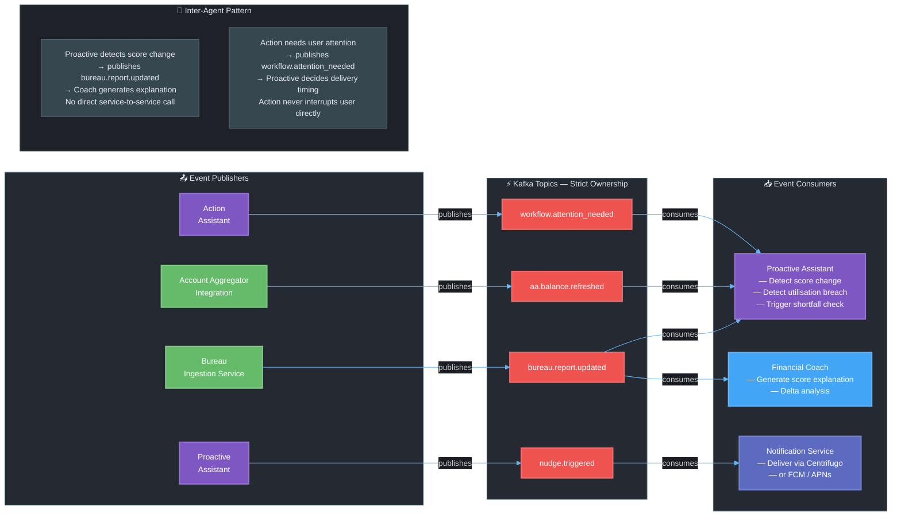

---

### 2.4 Async Workflow Architecture

How the Action Assistant handles two fundamentally different job shapes — fire-and-confirm vs. long-running multi-phase workflows — and how a paused workflow surfaces back to the user.

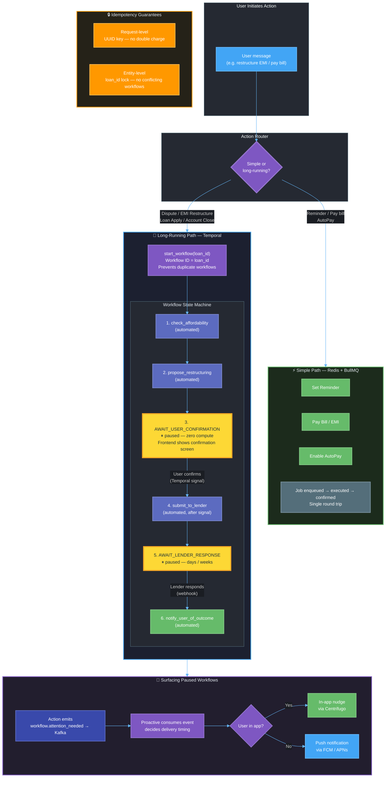

---

### 2.5 AI Infrastructure Stack

Model tier assignment, shared GPU cluster topology, and voice pipeline.

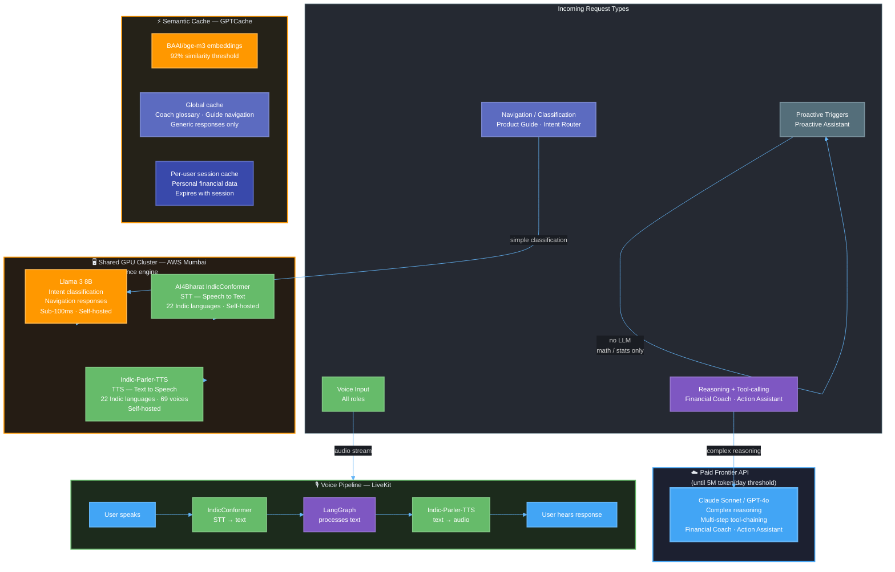

---

## 3. Shared Infrastructure Layer

### 3.1 Self-Hosted Voice Stack

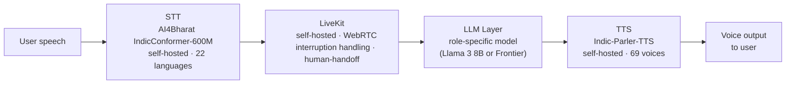

**Provider decision:** Sarvam (managed API) evaluated and rejected for steady-state use — self-hosted breakeven sits at ~22K–43K sessions/month on a single GPU instance; GoodScore's realistic volume is 38×–455× past that breakeven even under conservative engagement assumptions.

**Orchestration:** LiveKit chosen over Pipecat — not because of call-shape fit (Pipecat's leaner 1:1 design was the "obvious" pick) but because LiveKit ships interruption-handling, connection management, and a ready-made human-handoff pattern already built and maintained, trading some architectural elegance for materially faster shipping and lower long-term maintenance burden.

**Voice is a shared transport layer across all 4 roles** — not owned by any single role. The same LiveKit + STT + TTS pipeline is available to Product Guide, Financial Coach, Action Assistant, and Proactive Assistant. The LLM layer in the middle is role-specific (Llama 3 8B for Guide, frontier model for Coach and Action). Voice is a channel, not a feature of one agent.

**Shared by:** All 4 roles. All self-hosted models run on the shared GPU cluster (vLLM).

---

### 3.2 Tool Catalog (Deterministic Data Layer)

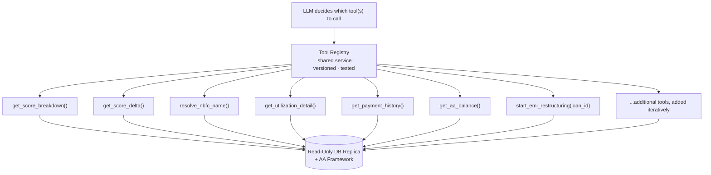

**Core decision:** Text-to-SQL (Gemini's original proposal) rejected outright — even high-accuracy generative query systems occasionally hallucinate a join or misfilter, which is an acceptable bug in most products but a trust-ending event in this one (an incorrect number about a user's own debt). Replaced with a catalog of fixed, pre-tested backend functions exposed to the LLM as callable tools.

**Chaining behavior:** "what" journeys (e.g. score breakdown) call one tool and stop. "why" journeys (e.g. why did my score change) chain multiple tools in sequence, inspecting each result before deciding the next call — this is why the orchestration layer needs LangGraph's stateful loop, not a one-shot pipeline.

**The Tool Registry is shared infrastructure** — not owned by any single role. Financial Coach uses it for data retrieval and explanation. Action Assistant uses it for workflow-trigger tools (`start_emi_restructuring`, `file_dispute`). The NBFC mapping table (`resolve_nbfc_name`) lives here, available to any role that needs it.

**Data sources the registry calls:** Read-only DB replica for all financial data (loans, scores, bills, repayment history). Account Aggregator framework for bank balance and transaction data. The LLM layer never touches a write path.

---

### 3.3 LLM Reasoning Layer

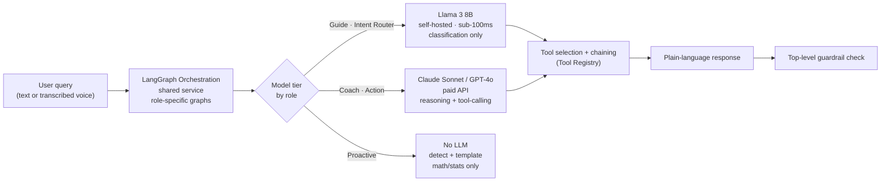

**Model tier assignment — locked per role:**

| Role | Model | Hosting | Rationale |
|---|---|---|---|
| Intent Router | Llama 3 8B | Self-hosted GPU | Classification task — no reasoning needed |
| Product Guide | Llama 3 8B | Self-hosted GPU | Navigation intent — simple, fast, cheap |
| Financial Coach | Claude Sonnet / GPT-4o | Paid API | Complex reasoning + multi-step tool-chaining |
| Action Assistant | Claude Sonnet / GPT-4o | Paid API | Workflow orchestration + financial reasoning |
| Proactive Assistant | None (Llama 3 8B at most for copy) | Self-hosted if needed | All journeys are detect-and-template — no LLM needed |

**Framework:** LangGraph (orchestration/state) on top of LangChain (tool/integration scaffolding). Required because tool-chaining for "why" journeys is stateful and branching, not a fixed sequence. LangGraph runs as a single shared service with role-specific graph definitions — not a separate deployment per role.

**Migration trigger for frontier model:** explicit and measurable — once production telemetry shows sustained volume crossing ~5M tokens/day, re-evaluate self-hosting. Not a vague someday plan.

**Shared by:** Financial Coach and Action Assistant share the frontier model path. Guide and Intent Router share the Llama 3 8B path. Proactive bypasses this layer entirely for all standard journeys.

---

### 3.4 Centrifugo — Real-Time Messaging Layer

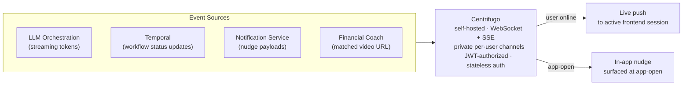

**What Centrifugo carries — strictly scoped:**

| Message type | Source | Destination |
|---|---|---|
| Streaming LLM response tokens | LangGraph Orchestration | Chat UI (bottom sheet) |
| Workflow status updates | Temporal / Action Assistant | Frontend workflow screen |
| In-app nudge payloads | Notification Service | Frontend at app-open |
| Matched video URL | Financial Coach | Frontend video player |

**Note on video:** Centrifugo delivers a matched video URL from the pre-recorded template library — not a render-queue completion notification. Per-user AI video generation (Wav2Lip) was evaluated and rejected; at 1 video/user/month self-hosted, cost exceeds 55% of actual monthly revenue.

**Rejected alternatives:**
- Bare-metal WebSockets: 65% of DIY implementations hit significant downtime; ~10.2 person-months to build; ~$100K–200K/year upkeep
- Ably (managed SaaS): MAU base fee alone ~10% of real monthly revenue at best-case volume pricing; ~50%+ at standard rates, before per-message and bandwidth charges

**Channel structure:** per-user private channels (`private:user_{user_id}`), JWT-authorized using the same internal trust token issued by the API Gateway. Stateless auth — Centrifugo validates the token without a DB lookup. Critical at 5M MAU with potentially millions of concurrent connections.

**Shared by:** All roles. Action Assistant was the primary justification; Proactive Assistant's in-app delivery, Financial Coach's video URL delivery, and all streaming LLM responses ride the same infrastructure.

---

### 3.5 Temporal — Durable Workflow Engine

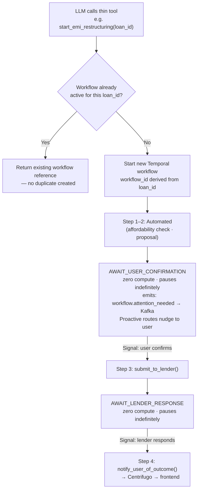

**Rejected alternative:** a single job queue (BullMQ/Redis) for every Action Assistant journey. A queue's contract is "a worker received this job" — it says nothing about whether a 6-phase process survived a crash on phase 3 without re-submitting to an external party. Compensating by hand (manual progress tracking, custom status tables, bespoke recovery scripts) is more total engineering effort than adopting a durable execution engine correctly.

**Idempotency model — two layers, not one:**
- **Request-level:** UUID idempotency key per call — catches retried network requests and double-taps
- **Entity-level:** workflow ID derived from the entity being acted on (e.g. `loan_id`) — catches two *different*, individually valid requests for the same entity (e.g. two different restructuring proposals for the same loan). An idempotency key alone does not catch this.

**Mid-process user input:** Temporal signals — a workflow pauses (zero compute) for an unbounded duration and resumes exactly where it stopped when a signal arrives. The workflow's own phase is the single source of truth for which screen the frontend renders.

**Workflow as backend entity:** the long-running request is independent of any chat thread. A user who starts restructuring on Tuesday and returns Thursday after a push notification should not have to scroll through chat history — they land directly on the correct workflow phase screen.

**Delivery handoff to Proactive:** when a workflow reaches a phase needing user attention, it emits `workflow.attention_needed` to Kafka. Proactive consumes the event and decides delivery timing (push notification or in-app nudge at app-open). Action Assistant never forces a screen directly — Proactive owns the "when to interrupt" judgment.

**Scope:** Action Assistant Journeys 3–6 only (disputes, EMI restructuring, loan applications, account closures). Journeys 1–2 (reminders, instant payments) use the simpler BullMQ path.

---

### 3.6 Kafka + BullMQ + Airflow — Async Infrastructure

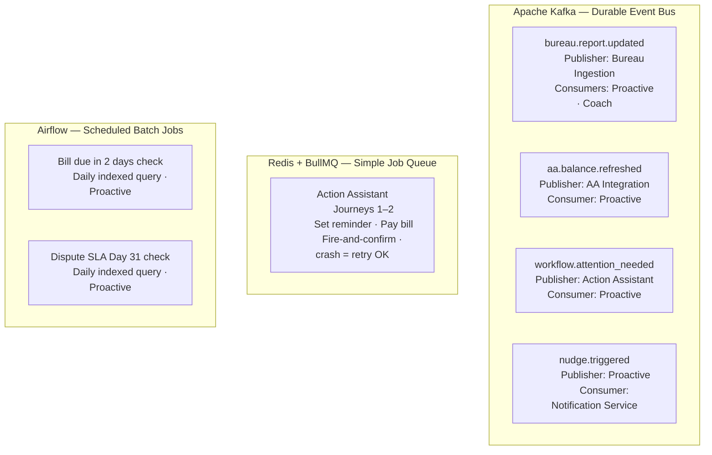

**Kafka — why not Redis Pub/Sub:** Redis Pub/Sub is fire-and-forget with no durability. If a consumer (Proactive, Coach) is momentarily down when an event is published, the event is lost. Kafka persists every event with configurable retention — a consumer that restarts can replay missed events. At 5M MAU with continuous bureau pulls, AA syncs, and workflow events, durability is not optional.

**Strict topic ownership:** each service publishes only to topics it owns; no role consumes its own topic. This enforces inter-agent boundaries in the architecture, not just in documentation.

**Kafka is for system-initiated async events only** — it is never in the user-facing synchronous request path. User message → API Gateway → Intent Router → Agent is a direct REST/gRPC call. Kafka sits entirely in the background event layer.

**BullMQ scope:** strictly Action Assistant Journeys 1–2 — short-lived, single-step actions where crash-and-retry-from-scratch is acceptable. Does not handle any multi-phase workflow.

**Airflow scope:** Proactive's two calendar-predictable checks (bill due, dispute SLA). One daily indexed batch query per check across the full user base — not a per-user scheduled job. Event-driven checks (score change, utilization breach, AA balance trend) go through Kafka pub/sub, not Airflow, because they fire on data change, not on a clock.

---

## 4. The 4 Agent Roles

---

### 4.1 Product Guide

**What it solves:** Navigation friction. Users can't find screens, get stuck mid-task, or don't know features exist.

**User journeys:**

| Journey | Trigger | Resolution |
|---|---|---|
| Direct navigation | "Where do I set up AutoPay?" | Intent → deep link → correct screen |
| In-flow assistance | Stuck on a field mid-dispute | Context-aware help using current screen from Redis session |
| Capability discovery | User manually pays same bill 3 months running | One-time nudge: "want me to automate this?" |
| Friction recovery | User can't find what they need | 2-step fallback → FAQ or human support |
| First-time onboarding | New install, zero mental model | Scripted welcome + guided tour offer |

**Key technical decisions:**

- **Server-side classification only** — on-device inference ruled out. Entry-tier Android devices (2–4GB RAM, MIUI) cannot reliably run even the smallest quantized models. On-device doesn't degrade gracefully here; it silently fails.
- **Llama 3 8B, self-hosted** — navigation is a classification task, not a reasoning task. No frontier model needed.
- **Standard deep linking** — Android App Links / iOS Universal Links. Backend sends semantic intent (`OPEN_DISPUTES_ACTIVE`), frontend maps to current route. Backend never hardcodes screen paths.
- **2-step failure path** — low confidence → one clarifying question → still unresolved → FAQ/support handoff. Never an open-ended retry loop.

**What makes it non-trivial:** The correct answer was on-device inference (faster, private, no round-trip). It had to be rejected because GoodScore's actual device fleet makes it non-viable — an assumption that sounds reasonable in the abstract but doesn't survive contact with real user hardware.

---

### 4.2 Financial Coach

**What it solves:** Turning a confusing credit report into something the user actually understands, grounded in their specific data.

**User journeys:**

| Journey | Trigger | Resolution |
|---|---|---|
| Score breakdown | First report view | Factor-by-factor explanation using actual user data |
| Delta explainer | Score moves ±X points | Diffs last two reports, identifies causal tradeline/event |
| NBFC resolution | "Who is Axio on my report?" | NBFC mapping table → "That's your Amazon Pay Later loan" |
| Utilization deep-dive | User asks why utilization hurts | Hyper-personalized: their card, their %, projected score impact of paydown |
| Progress recap | Weeks/months of effort | Monthly/quarterly narrative: "3 months ago 642, today 670, here's what changed" |
| Jargon onboarding | Low literacy first-time user | Vernacular glossary layer baked into every explanation — DPD explained on first use |

**Key technical decisions:**

- **Deterministic tools, not Text-to-SQL** — the LLM never generates SQL queries. A pre-built, tested tool catalog of backend API endpoints is exposed to the LLM as callable functions. LLM picks and chains tools; it never generates the query that fetches real financial data. Text-to-SQL is stochastic by nature — a wrong join in a financial product is a trust-destroying event, not a minor bug.
- **Tool catalog, not 1:1 journey mapping** — "why" journeys (delta explainer) require multi-step diagnostic chaining across multiple tool calls. "What" journeys (score breakdown) need a single lookup. The catalog covers both.
- **LangGraph orchestration** — stateful, branching, multi-step tool-calling loops. A one-shot pipeline cannot handle a diagnostic investigation that branches based on intermediate results.
- **Paid frontier model (Claude Sonnet / GPT-4o)** — self-hosting only wins past ~5M tokens/day sustained. Below that threshold, frontier APIs are cheaper once GPU rental + ops overhead is factored in. Migration is triggered by measured telemetry, not a calendar date.
- **Hybrid video — templated library, no AI generation** — per-user AI video generation (Wav2Lip) breaks the business at any real frequency. At 1 video/user/month self-hosted, cost exceeds 55% of actual monthly revenue. Pre-recorded templated library (~80–100 segments, score band × risk factor × language) is the only economically viable approach. Quarterly progress recap is the one use case where genuine personalization has highest ROI.
- **Voice: AI4Bharat IndicConformer + Indic-Parler-TTS, self-hosted** — Sarvam API pricing breaks unit economics past ~22K–43K voice sessions/month. At GoodScore's scale, self-hosting wins by an order of magnitude.
- **LiveKit for voice orchestration** — pre-built interruption handling, human-handoff pattern, production-grade at 5M MAU without custom infra ownership.

**What makes it non-trivial:** The data access layer. The instinct to use Text-to-SQL (standard pattern, well-documented) had to be rejected because the failure mode — wrong number delivered to a financially stressed, low-literacy user — is categorically different from a wrong answer in most other products.

---

### 4.3 Action Assistant

**What it solves:** Actually doing things for the user — actions that change real money and real legal state.

**User journeys:**

| Journey | Shape | Infrastructure |
|---|---|---|
| Set reminder / enable AutoPay | Single-step, instant | Redis + BullMQ |
| Pay bill / EMI | Single-step, money moves | Redis + BullMQ + idempotency |
| Raise bureau dispute | Multi-step, external party, slow | Temporal |
| EMI restructuring | Multi-step, human confirmation mid-flow, lender response | Temporal |
| Apply for loan | Multi-step, KYC, regulatory checkpoints | Temporal |
| Close loan / credit card | Can branch into restructuring if balance outstanding | Temporal |

**Key technical decisions:**

- **Two execution engines, not one** — Journeys 1–2 are fire-and-confirm: Redis + BullMQ is correct. Journeys 3–6 are long-running, multi-phase, must-survive-crash, must-wait-indefinitely: Temporal durable execution. Using a plain queue for Journeys 3–6 means manually re-building Temporal's guarantees inside application code — state machines backed by DB tables, custom scheduling, manual recovery scripts.
- **Dual idempotency** — two distinct guarantees both required:
  - *Request-level:* UUID generated client-side, checked server-side before any money/state movement. Protects against retries and double-taps.
  - *Entity-level:* lock tied to `loan_id` / `account_id`. One active restructuring per loan at a time, regardless of idempotency key. Two well-formed requests with different keys can still conflict at the business entity level.
- **Workflow as backend entity, independent of chat** — a user starting a restructuring Tuesday and returning Thursday after a push notification should not have to scroll through chat history to find their paused request. The workflow's current phase is the source of truth for which screen renders.
- **Proactive owns delivery timing** — when a workflow reaches a phase needing user attention, Action Assistant emits a Kafka event (`workflow.attention_needed`). Proactive decides when and how it surfaces — push notification, or in-app nudge at next app-open. Action Assistant never forces a screen directly.
- **Thin LLM tool layer** — LLM calls `start_emi_restructuring(loan_id)`, gets back a status reference. The 6 internal workflow phases are invisible to the LLM layer. Complexity lives in the Temporal workflow definition, not the LLM prompt.
- **Self-hosted Centrifugo** — live workflow status updates pushed to frontend over WebSocket. Rules out bare-metal WebSockets (65% DIY failure rate, 10.2 person-months to build) and managed SaaS like Ably (~10% of monthly revenue in MAU base fees alone).

**What makes it non-trivial:** The system must handle money-moving, multi-party workflows that can be interrupted by crashes, lender response delays, or the user simply closing the app — and resume correctly every time, without double-submitting or leaving data in a corrupt intermediate state.

---

### 4.4 Proactive Assistant

**What it solves:** Intervening before the user knows they need help — surfacing the right information at the right moment without becoming noise.

**User journeys:**

| Journey | Trigger type | Detection method |
|---|---|---|
| Score change | New bureau pull | Event-driven — Kafka pub/sub |
| Bill due in 2 days | Calendar | Time-driven — Airflow batch job |
| Utilization crossed 75% | Bureau data threshold | Event-driven — Kafka pub/sub |
| Predicted EMI shortfall | AA balance trend vs EMI due | Event-driven — moving average on AA data |
| Dispute SLA Day 31 | Calendar | Time-driven — Airflow batch job |

**Key technical decisions:**

- **Zero LLM** — all 5 journeys are detect-and-template pipelines. Detection is either a threshold check, a date comparison, or a moving average on AA balance data. Notification copy is a fixed template with interpolated variables. No model inference needed anywhere in this role.
- **AA framework over SMS parsing** — Gemini's original proposal (SMS parsing on-device) is non-viable. Google Play policy requires an app to be the user's default SMS handler to declare READ_SMS. GoodScore is a credit app, not an SMS app — there is no path to becoming a default SMS handler, and Google has actioned 3,500+ Indian lending apps for exactly this violation. Account Aggregator (RBI-regulated, 252.9M linked accounts, GoodScore registers as FIU) is the correct, sanctioned mechanism.
- **Two trigger shapes → two infrastructure pieces** — time-driven (bill due, dispute SLA): daily Airflow batch query against indexed Postgres. Event-driven (score change, utilization, balance trend): Kafka pub/sub, fires the moment upstream data changes. No polling millions of records.
- **Two delivery entry points only** — push notification (app closed) or in-app nudge at app-open. Nudges are never injected mid-session. Eliminates the entire queue-and-resume complexity class.
- **Nudge Governor** — sits between "N conditions are true for this user" and "what do we actually send." Daily cap (max 1–2 nudges/user/day), priority ranking (regulatory/money-owed beats informational), cooldown per nudge type. State in Redis — fast reads/writes, ephemeral, TTL-managed.
- **Dedicated Notification Service** — Proactive publishes `nudge.triggered` to Kafka. Notification Service consumes it, checks user presence (connected to Centrifugo?), routes to Centrifugo (in-app) or FCM/APNs (push). Proactive never owns delivery logic.

**What makes it non-trivial:** The hard problem is restraint, not generation. A false positive ("you're about to miss your EMI") sent to a financially stressed user is not a neutral inconvenience. The system must be silent on ambiguous signals and only speak when confidence is high.

---

## 5. Data Flow Diagrams

### 5.1 Synchronous Flow — User Sends a Message

```
User types message
       │
       ▼
  API Gateway
  (validates JWT → issues internal trust token)
       │
       ▼
  Intent Router
  (Llama 3 8B classifies intent → selects agent)
       │
       ▼
  PII Middleware
  (strips PAN, account IDs, phone numbers → anonymised tokens)
       │
       ▼
  LangGraph Orchestration
  (loads role-specific graph, reads session state from Redis)
       │
       ├─── Semantic Cache check (GPTCache)
       │    ├── HIT  → return cached response instantly
       │    └── MISS → continue to LLM
       │
       ▼
  Tool Registry
  (LLM selects tool → deterministic API call → Read-Only DB Replica)
       │
       ▼
  LLM (Frontier / Llama 3 8B depending on role)
  (narrates tool result in plain language)
       │
       ▼
  PII Re-mapping
  (anonymised tokens → real values restored)
       │
       ▼
  Centrifugo
  (streams response tokens to frontend in real time)
       │
       ▼
  Chat UI (bottom sheet)
  (renders streamed tokens as they arrive)
```

---

### 5.2 Async Flow — Proactive Nudge End-to-End

```
Bureau Ingestion Pipeline
(new credit report pulled)
       │
       ▼
  Kafka: bureau.report.updated
       │
       ├──────────────────────────────────┐
       ▼                                  ▼
  Proactive Assistant               Financial Coach
  (score delta detected)            (subscribes if explanation needed)
       │
       ▼
  Nudge Governor
  (daily cap check · priority ranking · cooldown check — Redis)
       │
       ├── SUPPRESSED → silent (cap reached or cooldown active)
       │
       └── APPROVED
              │
              ▼
         Kafka: nudge.triggered
              │
              ▼
         Notification Service
         (checks Centrifugo presence)
              │
              ├── User online  → Centrifugo in-app nudge at next app-open
              └── User offline → FCM / APNs push notification
```

---

### 5.3 Long-Running Flow — Action Assistant Temporal Workflow (EMI Restructuring)

```
User: "I can't pay my full EMI"
       │
       ▼
  Intent Router → Action Assistant
       │
       ▼
  LLM calls: start_emi_restructuring(loan_id)
       │
       ▼
  Temporal Workflow starts
  (workflow_id derived from loan_id → prevents duplicate workflows)
       │
       ▼
  Step 1: check_affordability()
  (Tool Registry → AA framework → bank balance)
       │
       ▼
  Step 2: propose_restructuring()
  (calculates new EMI schedule)
       │
       ▼
  Step 3: AWAIT_USER_CONFIRMATION
  (workflow pauses — zero compute consumed while waiting)
  (emits: workflow.attention_needed → Kafka)
  (Proactive routes to user: push or in-app nudge)
       │
  User sees confirmation screen, approves terms
       │
       ▼
  Signal received → workflow resumes
       │
       ▼
  Step 4: submit_to_lender()
  (external lender API call)
       │
       ▼
  Step 5: AWAIT_LENDER_RESPONSE
  (workflow pauses again — indefinitely if needed)
       │
  Lender responds
       │
       ▼
  Step 6: notify_user_of_outcome()
  (Centrifugo → frontend)
```

**Key guarantees this flow provides:**
- Crash at any step → workflow resumes from exact step, not from scratch
- User closes app mid-flow → workflow state persists, user returns to correct screen on reopen
- Duplicate restructuring request for same loan → Temporal returns existing workflow, does not create a second one
- Lender takes 3 days to respond → workflow waits at Step 5 consuming zero compute

---

## 6. Key Architectural Decisions & Trade-offs

| Decision | Options Considered | Chosen | Rejected | Why |
|---|---|---|---|---|
| Financial data access | Text-to-SQL vs Deterministic tool catalog | Deterministic tool catalog | Text-to-SQL | Text-to-SQL is stochastic — wrong SQL join in a financial product is a trust-destroying event, not a minor bug |
| Voice data source (EMI shortfall) | SMS parsing vs Account Aggregator | Account Aggregator (AA framework) | SMS parsing | Google Play policy requires default SMS handler to use READ_SMS — no viable path for a credit app; Google has actioned 3,500+ Indian lending apps for this exact violation |
| Voice STT/TTS provider | Sarvam API vs AI4Bharat self-hosted | AI4Bharat self-hosted | Sarvam API | Sarvam breaks unit economics past ~22K sessions/month; GoodScore is 38–76x past that breakeven even at conservative engagement estimates |
| Video personalization | Per-user AI video (Wav2Lip) vs Templated library | Templated library | Per-user AI video | At 1 video/user/month self-hosted, cost exceeds 55% of actual monthly revenue; per-user generation is not economically viable at this scale |
| On-device inference (Product Guide) | On-device SLM vs Server-side classifier | Server-side | On-device | Entry-tier Android (2–4GB RAM, MIUI) cannot run even smallest quantized models; on-device doesn't degrade gracefully, it silently fails |
| Action Assistant execution engine | Redis+BullMQ only vs Temporal + BullMQ | Temporal for long-running, BullMQ for simple | BullMQ only | Plain queue for multi-step workflows means manually re-building crash recovery, state machines, and resume logic in application code |
| Real-time messaging | Bare-metal WebSockets vs Ably vs Centrifugo | Self-hosted Centrifugo | Both alternatives | Bare-metal: 65% DIY failure rate, 10.2 person-months; Ably managed SaaS: MAU base fee alone ~10% of monthly revenue |
| Proactive LLM usage | LLM for nudge copy vs Zero LLM | Zero LLM | LLM | All 5 journeys are detect-and-template — threshold checks, date comparisons, moving averages. No language understanding needed anywhere in this role |
| Inter-agent delivery timing | Action pushes screen directly vs Proactive owns delivery | Proactive owns delivery | Direct screen push | Action pushing directly mid-session interrupts users in unrelated flows; Proactive already owns "when to interrupt user" judgment |
| Event bus | Redis Pub/Sub vs Kafka | Kafka | Redis Pub/Sub | Redis Pub/Sub is fire-and-forget — no durability. If a consumer is momentarily down, events are lost. Kafka persists with configurable retention |

---

## 7. Inter-Agent Communication Design

All inter-agent communication is async via Kafka. No role calls another role directly.

### Kafka Topic Ownership

| Topic | Publisher | Consumers | Triggered by |
|---|---|---|---|
| `bureau.report.updated` | Bureau Ingestion Service | Proactive, Financial Coach | New credit report pulled |
| `aa.balance.refreshed` | AA Integration Service | Proactive | Bank balance/transaction sync |
| `workflow.attention_needed` | Action Assistant | Proactive | Workflow reaches human-input phase |
| `nudge.triggered` | Proactive Assistant | Notification Service | Nudge approved by Nudge Governor |

### Inter-Agent Handoff Patterns

**Proactive → Financial Coach**
- Trigger: `bureau.report.updated` consumed by both
- Proactive detects score delta, surfaces nudge ("your score changed")
- User taps nudge → Intent Router routes to Financial Coach
- Coach generates explanation using deterministic tool catalog
- No direct call between roles — user action is the bridge

**Proactive → Action Assistant**
- Trigger: AA balance data shows predicted EMI shortfall
- Proactive surfaces nudge ("your EMI might be tight")
- User taps CTA → Intent Router routes to Action Assistant
- Action starts `start_emi_restructuring` Temporal workflow
- No direct call — user intent is the bridge

**Action Assistant → Proactive**
- Trigger: Temporal workflow emits `workflow.attention_needed` to Kafka
- Proactive consumes event, runs through Nudge Governor
- Delivers via push notification or in-app nudge at app-open
- Action never pushes a screen directly — Proactive owns delivery timing

---

## 8. Technology Stack Reference

### Core Infrastructure

| Component | Technology | Hosting | Rationale |
|---|---|---|---|
| API Gateway | Custom / Kong | AWS Mumbai | Thin — auth, rate limiting, TLS only |
| Intent Router | Llama 3 8B + custom classifier | Self-hosted GPU | Decoupled from Product Guide classifier |
| LLM Orchestration | LangGraph + LangChain | Shared service | Single deployment, role-specific graphs |
| Real-time messaging | Centrifugo | Self-hosted | 1M connections, 30M msgs/min on single server |
| Voice transport | LiveKit | Self-hosted | Pre-built interruption handling, human-handoff |
| Event bus | Apache Kafka | AWS Mumbai | Durable, replayable, strict topic ownership |
| Durable workflows | Temporal | Self-hosted | Action Assistant Journeys 3–6 |
| Simple job queue | Redis + BullMQ | Self-hosted | Action Assistant Journeys 1–2 |
| Scheduled jobs | Airflow | AWS Mumbai | Time-driven Proactive triggers |

### AI / Model Stack

| Component | Technology | Hosting | Used by |
|---|---|---|---|
| Navigation + routing classifier | Llama 3 8B (vLLM) | Shared GPU cluster | Intent Router, Product Guide |
| Reasoning + tool-calling | Claude Sonnet / GPT-4o | Paid API | Financial Coach, Action Assistant |
| Voice STT | AI4Bharat IndicConformer | Shared GPU cluster | All roles via LiveKit |
| Voice TTS | Indic-Parler-TTS | Shared GPU cluster | All roles via LiveKit |
| Embeddings + semantic cache | BAAI/bge-m3 + GPTCache | Shared GPU cluster | Coach glossary, Guide navigation |
| Vector store | FAISS / Qdrant | Self-hosted | Coach glossary (~50–100 concepts) |

### Data Layer

| Store | Technology | Data | Notes |
|---|---|---|---|
| Primary database | PostgreSQL | Chat history, user data, device tokens, audit log | AWS Mumbai, RBI compliant |
| Session + cache | Redis | Session state, notif caps, idempotency keys, cooldown state | Ephemeral, TTL-managed |
| Read-only replica | PostgreSQL replica | All financial query reads | LLM tools query here only — cannot mutate |
| Bank data | Account Aggregator (Finvu / OneMoney) | Bank balance, transactions | RBI-regulated FIU integration |
| Credit data | Bureau Ingestion Pipeline | Experian, CIBIL, Equifax reports | Publishes to Kafka on new pull |
| NBFC mapping | Tool Registry (Postgres-backed) | Fintech brand → NBFC name | Shared across all roles |

### Frontend

| Component | Technology | Notes |
|---|---|---|
| Mobile app | React Native / Flutter (current stack) | Not prescribed — framework-agnostic decisions throughout |
| Chat interface | Bottom sheet overlay | Persistent across all screens; carries current screen context to session |
| Deep linking | Android App Links / iOS Universal Links | Backend sends semantic intent, frontend maps to route |
| Real-time channel | Centrifugo WebSocket | Per-user private channel, JWT-authorized, stateless auth |
| Voice channel | LiveKit WebRTC | Parallel to Centrifugo — no overlap in responsibility |

### Compliance

| Requirement | Implementation |
|---|---|
| RBI data residency | All compute and storage on AWS Mumbai |
| PII protection | Dedicated PII middleware strips identifiers before every LLM call |
| Bank data access | Account Aggregator framework — consent-first, revocable, RBI-regulated |
| Dispute SLA tracking | Airflow batch job — Day 31 auto-triggers compensation claim |
| Idempotency (payments) | UUID request-level + entity-level loan/account lock |
| Read-only data access | LLM tools query read replica only — no write path exposed to AI layer |
---

## 9. Consolidated open risks

| Risk | Affects | Why it matters |
|---|---|---|
| Open-source Indic ASR/TTS accuracy on real (noisy, code-mixed) user audio is unverified | Coach, Guide (shared compute) | Published benchmarks aren't a substitute for testing on GoodScore's actual call patterns |
| Real engagement/volume numbers (Coach session %, LLM tokens/day) are industry-benchmark estimates, not measured | Coach | Every cost projection in this system should be re-run once production telemetry exists |
| Device fleet assumption (2–4GB RAM) is inferred from income/pricing data, not measured | Guide | Worth confirming against GoodScore's actual install-base telemetry before fully closing the door on on-device |
| Account Aggregator integration has real regulatory lead time | Proactive | FIU registration and AA partner onboarding is a business process, not a pure engineering task — must start early |
| Notification cap/cooldown thresholds are design intent, untested | Proactive | Needs real engagement data to avoid both under- and over-notifying |
| Temporal operational overhead (cluster ops, deterministic-workflow discipline) is real and not yet sized | Action | A genuine new skill/ops investment for the team, distinct from anything the other three roles require |
| Action → Proactive coupling is a new cross-role dependency | Action, Proactive | Needs a clear contract so a failure in one role's delivery logic doesn't silently strand the other's event |

---

## 10. Summary

Four roles, one shared infrastructure layer, one governing economic constraint, and a consistent design philosophy applied differently per role based on what each role's specific risk actually is:

- **Coach** — cost discipline + trust-by-construction (deterministic tools over generative SQL)
- **Guide** — narrow scope + device-reality discipline (server-side over assumed-viable on-device)
- **Proactive** — regulatory discipline + restraint discipline (sanctioned data access, notification governance)
- **Action** — correctness discipline (durable execution and explicit locking over hand-rolled bookkeeping)

The same underlying principle — **don't reach for the expensive or the generative option until the cheap, deterministic, self-hosted option has been proven insufficient** — produced four different concrete architectures because each role's actual constraint was different. That's the system.
