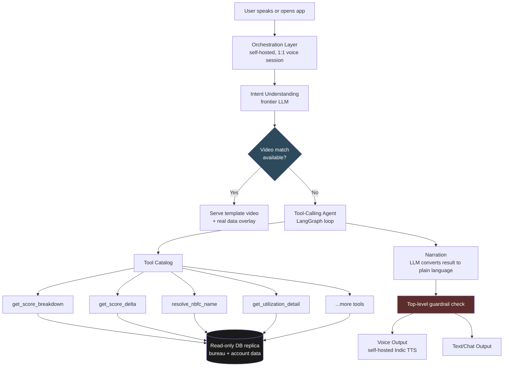

# Financial Coach — Architecture & Design Decisions
### One of four GoodScore AI Assistant role architectures

> **Thesis:** Cheap by default, trustworthy by construction. Every decision in this document optimizes for two constraints simultaneously — GoodScore's real unit economics, and the fact that a financial app cannot afford to be confidently wrong.

---

## 1. Who this is for

The Coach exists for one reason: **GoodScore's users are credit-active, financially shocked, and have low financial literacy.** They don't need a chatbot. They need someone to explain *their own numbers* in language they trust.

| Journey | Trigger | What Coach does |
|---|---|---|
| 1. First report view | User sees a score for the first time | Factor-by-factor breakdown of *why* the score is what it is |
| 2. Score change | New bureau pull moves the score | Causal explanation — what specifically changed, and why |
| 3. Unknown lender name | User sees "Axio" / "Arthimpact" on report | Instant trust-repair: maps the name to the fintech app they recognize |
| 4. Utilization confusion | User told "reduce utilization," doesn't know why it matters | Personalized mechanism explainer using their actual card and number |
| 5. Progress check | Weeks/months into recovery | Retention moment — "3 months ago you were at 642, today you're 670" |
| 6. Jargon | First-time credit users, zero literacy | Plain-language glossary baked into every explanation |

**The pattern:** every journey is triggered by the user's *real data changing* — not open-ended chat. This is an event-driven, data-grounded system, not a general assistant.

---

## 2. The constraint that shaped every decision below

GoodScore charges **₹100/month, mandatory autopay at registration.** That sounds like a comfortable budget at 5M MAU — until you check the real number.

```
Theoretical ceiling (100% of 5M MAU paying):     ₹50 Cr / month
Actual reported revenue (FY25):                  ₹52.1 Cr / YEAR  →  ~₹4.34 Cr / month
```

**The real budget we're protecting is ~12x smaller than the headline number suggests.** Every architecture choice below was pressure-tested against ₹4.34 Cr/month, not ₹50 Cr/month. This is why "use the best available model/API for everything" was never on the table.

---

## 3. System architecture



**Read this diagram once, remember three things:** (1) data never comes from a generated query — it comes from a fixed tool catalog, (2) video is checked before generation is ever considered, (3) everything downstream of the orchestration layer is self-hosted or volume-triggered toward self-hosting.

---

## 4. Five core decisions

Each shown with the alternative we seriously considered and rejected — because the "why not" is as important as the "what."

### Decision 1 — Voice stack: Sarvam → self-hosted, volume-triggered

| | Sarvam (managed API) | **Self-hosted (AI4Bharat IndicConformer + Indic-Parler-TTS)** |
|---|---|---|
| Cost at 15% Coach engagement | ₹1.14 Cr/month (**26% of actual revenue**) | ₹50K–1L/month flat |
| Breakeven point | — | ~22K–43K sessions/month |
| GoodScore's real volume | — | **38×–455× past breakeven**, even at conservative estimates |

**Verdict: self-hosted by default.** Sarvam's accuracy edge on code-mixed Hinglish speech is real — but not worth 10–25% of total company revenue at this scale. This isn't a someday-migration; the math says self-host from day one.

### Decision 2 — Video: template library, not full personalization

| | Self-hosted AI avatar (Wav2Lip), generated per user per event | **Template library + quarterly personalized recap only** |
|---|---|---|
| Cost at 1 video/user/month | ₹2.42 Cr/month (**56% of actual revenue**) | ~₹10–30L one-time (CapEx), near-zero recurring |
| Personalization | Fully bespoke render, every time | Segment-matched template + real data overlay; true personalization reserved for one high-trust moment/quarter |

**Verdict: template-first.** Even the *cheap* self-hosted avatar option breaks the business at realistic frequency. Personalized video is earned, not default — reserved for the Journey 5 progress recap, where bespoke effort has the highest emotional payoff per rupee spent.

### Decision 3 — Orchestration: LiveKit over Pipecat

GoodScore's Coach is always exactly 1 user + 1 AI — Pipecat's leaner, purpose-built shape looked like the obvious fit on paper. **We rejected that framing.** The business question wasn't "what matches our call shape" — it was "what ships a production-ready experience fastest, with the least code our team has to own and maintain at 5M MAU."

LiveKit ships interruption-handling, connection management, and a ready-made human-handoff pattern (AI → live agent) already built and maintained. Pipecat would require us to build and own more of that ourselves.

**Verdict: LiveKit, self-hosted.** Architectural elegance lost to shipping speed and lower long-term maintenance burden — the right trade for a small team against a 5M-MAU production deadline.

### Decision 4 — Data layer: deterministic tools, not Text-to-SQL ⚠️ *the sharpest call in this doc*

Gemini's original research proposed a Text-to-SQL pipeline — LLM generates queries on the fly against the user's financial data, with schema-linking and self-correction.

**Rejected.** Text-to-SQL is stochastic by construction — even high-accuracy systems occasionally hallucinate a join or misfilter. That's an acceptable bug in most products. In this one, it means **telling a financially stressed user an incorrect number about their own debt** — not a quality miss, a trust-ending event for the exact demographic GoodScore exists to serve.

**Verdict: a catalog of fixed, pre-tested backend tools**, exposed to the LLM as callable functions. The LLM's job shrinks to *which* tool to call and how to narrate the result — the actual number never passes through a generative step. "Why" journeys (e.g. Journey 2 — why did my score change) chain multiple tools in sequence, inspecting each result before deciding the next call; "what" journeys call one tool and stop.

### Decision 5 — LLM + framework: frontier model + LangGraph, self-host volume-triggered

| | Self-hosted open-source LLM | **Paid frontier model (Claude/GPT-class)** |
|---|---|---|
| Breakeven vs. API | ~5M tokens/day sustained | — |
| Tool-calling reliability | Less proven at structured function-calling | More dependable — this layer leans almost entirely on correct tool selection |
| Current volume data | Not yet measured | — |

**Verdict: frontier model now, self-host once real token volume crosses the measured 5M/day threshold** — not a vague someday plan, a specific number we'll watch in production telemetry.

**Framework: LangGraph on top of LangChain**, not LangChain alone — because Decision 4's tool-chaining ("why" journeys looping through multiple tool calls) is stateful, branching behavior, not a one-shot pipeline.

---

## 5. Cost summary

*(against real revenue of ~₹4.34 Cr/month, at a 15% Coach-engagement assumption)*

| Component | Approach | Monthly cost | % of real revenue |
|---|---|---|---|
| Voice (STT/TTS) | Self-hosted | ₹50K–1L | <1% |
| Video — template library | One-time CapEx | ~₹0 recurring | ~0% |
| Video — personalized recap | Self-hosted, quarterly cadence | Low, scales with quarterly not monthly frequency | Low single digits |
| Orchestration | Self-hosted LiveKit | Compute only (shared GPU footprint) | Marginal |
| LLM reasoning | Frontier API, narrow tool-calling usage | TBD — volume not yet measured | Watched against 5M tokens/day threshold |

**The pattern holding across every layer: self-hosted/open-source by default, paid/managed as a deliberate, volume-justified exception** — not a preference, close to a hard requirement at this revenue base.

---

## 6. What ships first

1. **Tool catalog + data layer** — the foundation everything else calls into; nothing else works without it
2. **Text-based Coach (Journeys 1, 3, 6)** — score breakdown, NBFC resolution, glossary — lowest technical risk, immediate trust-building value
3. **Voice layer (self-hosted)** — once text-based tool-calling is proven correct
4. **Template video library** — parallel content production track, doesn't block engineering
5. **Personalized quarterly recap** — last, highest production complexity, lowest frequency

---

## 7. Open risks / what we're watching

- **Open-source Indic ASR/TTS accuracy** on noisy, code-mixed speech from our actual demographic is unverified — needs benchmarking against real user audio, not published benchmarks alone
- **Real Coach-engagement rate** is currently an industry-benchmark estimate (15% of DAU), not measured — every cost projection in this doc should be re-run once we have real telemetry
- **LLM token volume** for the reasoning layer is unmeasured — the self-hosting migration trigger (5M tokens/day) needs production data before we can act on it
- **Tool catalog completeness** — "why" journeys may surface data needs we haven't anticipated; the catalog will need to grow iteratively, not ship complete on day one
