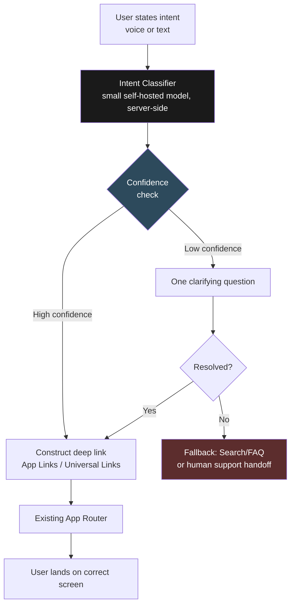

# Product Guide — Architecture & Design Decisions
### One of four GoodScore AI Assistant role architectures

> **Thesis:** Narrow scope, small model, deterministic fallback. Guide doesn't reason about financial data — it maps intent to location, fast and cheap, riding entirely on infrastructure already justified elsewhere.

---

## 1. Who this is for

Guide exists to remove friction. **GoodScore's users are low financial literacy, often new to credit apps, and on a small/cluttered screen they don't know well.** They don't need a chatbot that reasons about their finances — they need someone to get them to the right screen, fast.

| Journey | Trigger | What Guide does |
|---|---|---|
| 1. First-time onboarding | User opens the app for the first time | Proactive welcome + guided tour offer |
| 2. Direct navigation | User knows what they want, not where it lives | Natural language → deep link, straight to the screen |
| 3. In-flow assistance | User is mid-task and hits a confusing field/step | Context-aware help using the screen the user is currently on |
| 4. Capability discovery | User doesn't know a feature (AutoPay, reminders) exists | Light, behavior-triggered nudges — rare, earned, never spam |
| 5. Friction recovery | User hits an error or can't find what they need | One clarifying attempt, then deterministic handoff to search/support |

**The pattern:** every journey is triggered by the user *expressing an intent* — not by their underlying data changing. This is an intent-driven system, not an event-driven one. Guide never needs to reason about a user's financial data — only about where things live in the app.

---

## 2. The constraint that shaped every decision below

Same real-revenue constraint as every other role: **~₹4.34 Cr/month actual revenue, not the ₹50 Cr theoretical ceiling.** But Guide's defining constraint isn't cost — cost turns out to be close to zero by design (Decision 3). Guide's defining constraint is **the device fleet GoodScore's actual users are on.**

```
GoodScore's ICP (per founder interview):  ~Rs.35,000-40,000/month income,
                                            often single earner, post-default
Realistic device class:                    Secondhand or entry-tier Xiaomi/Redmi,
                                            2-4GB RAM, heavy OS skin (MIUI/HyperOS)
Minimum RAM for even a 1B-param on-device
model to run reliably:                     ~4GB free
```

**This single fact rules out an entire category of architecture before any cost question even comes up.** On-device inference — the "obvious" answer for a low-latency navigation assistant — simply doesn't run on the hardware most GoodScore users actually own.

---

## 3. System architecture



**Read this diagram once, remember three things:** (1) classification is small and server-side, never on-device, (2) there's exactly one clarifying retry before deterministic fallback — never a chat spiral, (3) navigation rides on the app's existing router, not a custom system Guide owns.

---

## 4. Three core decisions

Each shown with the alternative we seriously considered and rejected — because the "why not" is as important as the "what."

### Decision 1 — On-device vs. server-side classification ⚠️ *the sharpest call in this doc*

The obvious instinct for a navigation assistant is on-device inference — zero network latency, works offline, keeps navigation intent (which can reveal financial behavior) off the network entirely.

| | On-device classification | **Server-side classification** |
|---|---|---|
| RAM needed (1B-param quantized model) | ~4GB free, minimum | N/A — runs on GoodScore's own infrastructure |
| GoodScore's realistic device class | 2–4GB RAM total, OS already resident | N/A |
| Result on the actual fleet | Doesn't degrade gracefully — **doesn't run at all** | Reliable network round-trip, hundreds of ms |

**Rejected.** "On-device SLMs are viable in 2026" is true for the device class the industry benchmarks against — flagship and upper-mid-range phones. It is not true for GoodScore's actual users, who are disproportionately on secondhand or entry-tier devices precisely because they're a single earner in financial recovery. Building Guide's default path around on-device inference means building a feature that silently fails for a large share of the install base.

**Verdict: server-side, self-hosted, by default — no on-device tier in v1.** The small classifier model still runs cheap and self-hosted (Decision 3), it just runs on GoodScore's servers, not the user's phone. On-device is left open only as a future *additive* fast-path if telemetry later shows a meaningful share of MAU on 6GB+ devices — never assumed.

### Decision 2 — Custom navigation engine vs. standard deep linking

| | Custom-built navigation/routing layer | **Standard deep linking (App Links / Universal Links)** |
|---|---|---|
| Engineering surface | Intent → custom screen-rendering logic, owned and maintained from scratch | Intent → deep link string, handed to existing router |
| Risk of drift | New parallel system can fall out of sync with the real app | Bounded by GoodScore's already-tested navigation infrastructure |

**Rejected (custom build).** There's no reason to invent a routing protocol when deep linking is a solved, standard mobile engineering problem already powering notifications and external links into most apps, including (presumably) GoodScore's own.

**Verdict: Guide classifies intent, constructs a standard deep link, hands it to the existing app router.** This keeps Guide thin by design — its only real surface area is "intent → deep link string."

### Decision 3 — Standalone infrastructure vs. shared with Financial Coach

| | Guide as a separately provisioned stack | **Guide riding on Coach's self-hosted footprint** |
|---|---|---|
| New GPU/infra spend | A new line item to justify | None — small classifier adds marginal load to infrastructure Coach's voice stack already requires |
| Cost as % of real revenue | Would need its own analysis | Effectively ~0% — not separately costed |

**Rejected (standalone provisioning).** Guide's classification model is small enough that provisioning it separately would mean paying twice for "self-hosted GPU capacity" when Coach's voice stack (Q1 of that architecture doc) already commits to exactly that infrastructure class.

**Verdict: Guide is designed to run on Coach's existing self-hosted footprint.** The only genuinely new cost is the one-time work of training/fine-tuning the intent classifier on GoodScore's actual navigation vocabulary — not new hardware spend.

---

## 5. Cost summary

*(against real revenue of ~₹4.34 Cr/month)*

| Component | Approach | Monthly cost | % of real revenue |
|---|---|---|---|
| Intent classification | Small self-hosted model, riding on Coach's GPU footprint | ~₹0 marginal | ~0% |
| Navigation/routing | Standard deep linking via existing app router | ~₹0 — reuses existing infra | 0% |
| Fallback (search/FAQ/support handoff) | Existing support infrastructure | No new spend | 0% |
| One-time | Classifier training/fine-tuning on navigation vocabulary | Small, one-time | Negligible |

**Guide is the one role in this system that doesn't need its own cost line.** Every other role (Coach, and likely Action/Proactive) required real trade-off math against the ₹4.34 Cr/month ceiling. Guide's entire economics rest on a single design choice — reuse, don't reprovision — and that choice is enabled directly by Decision 1's conclusion that this has to be a small, server-side, self-hosted model in the first place.

---

## 6. What ships first

1. **Deep link map + standard App Links/Universal Links setup** — the foundation; nothing else works without a verified link structure into every screen Guide needs to reach
2. **Intent classifier (Journey 2 — direct navigation)** — highest frequency, lowest ambiguity, proves the core loop end to end
3. **Clarifying-question + fallback path (Journey 5)** — must exist before wider rollout, so failures degrade safely instead of looping users
4. **In-flow / context-aware help (Journey 3)** — requires passing current-screen context into the classifier, slightly more engineering than flat intent matching
5. **Onboarding tour + capability nudges (Journeys 1, 4)** — lowest technical risk, but needs product/content input on tour structure and nudge cadence, so it trails the harder engineering work

---

## 7. Open risks / what we're watching

- **Device fleet assumption is inferred, not measured** — the 2–4GB RAM device-class conclusion is built from the founder's stated ICP income and researched India device pricing, not GoodScore's actual device telemetry. Worth confirming against real install-base data before fully ruling out on-device.
- **Classifier accuracy on GoodScore's actual navigation vocabulary** is unverified — intent classification is only as good as the training data; needs real user phrasing, not assumed phrasing, before launch.
- **Fallback support capacity** — Decision in Q5 of the underlying analysis routes unresolved cases to human support; this assumes that support capacity exists and isn't itself a bottleneck, which hasn't been validated against GoodScore's current support team sizing.
- **Capability-discovery nudges (Journey 4) risk feeling spammy if miscalibrated** — the "rare and earned" cadence is a design intent, not yet a tested threshold; needs real engagement data to tune.
