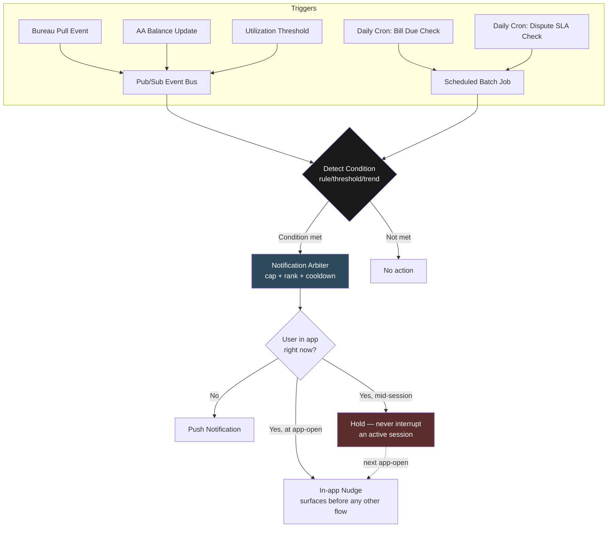

# Proactive Assistant — Architecture & Design Decisions
### One of four GoodScore AI Assistant role architectures

> **Thesis:** Cheap by construction, restrained by design. Proactive's hard problem isn't generating messages — it's knowing when to stay silent. Every decision here optimizes for sound, sanctioned data access and disciplined notification behavior over raw technical ambition.

---

## 1. Who this is for

Proactive exists because **GoodScore's users shouldn't have to ask for help to get it.** They're financially shocked, often anxious about their accounts, and benefit from being told what matters before they think to check.

| Journey | Trigger | What Proactive does |
|---|---|---|
| 1. Score change | New bureau pull moves the score | Surfaces the change + causal explanation at next app open |
| 2. Bill due | Known due date approaching | Scheduled reminder with one-tap pay/remind action |
| 3. Utilization threshold | Bureau data crosses 75% utilization | Threshold alert on what's driving the spike |
| 4. Predicted shortfall | Bank balance trend suggests an EMI is at risk | Directional risk-flag, never a confident prediction |
| 5. SLA breach | Bureau dispute open 30+ days | Automatic compensation claim + Ombudsman escalation path |

**The pattern:** every journey is **system-initiated** — nobody asked. That single property makes this role categorically different from a request-response assistant: every message sent is an interruption, and a wrong or poorly-timed one carries a real cost in trust.

---

## 2. The constraint that shaped every decision below

Proactive's defining constraint isn't cost — most of this role turns out to be close to free by construction (Decision 1 makes that case directly). The real constraint is **regulatory and platform viability** — specifically, the data source the brief itself proposed for the hardest journey.

```
Brief's proposed approach (Journey 4):  Parse user SMS on-device to predict EMI shortfalls
Reality check:                          Google Play requires an app to be the user's
                                         default SMS handler to even request READ_SMS
GoodScore's actual status:               A credit app, not an SMS app —
                                         no realistic path to default-handler status
```

**This single fact rules out the brief's own proposed mechanism before any UX question even comes up.** An app built around SMS parsing for this purpose risks not surviving Play Store review at all — a distribution-eligibility problem, not a consent-UX problem to be designed around.

---

## 3. System architecture



**Read this diagram once, remember three things:** (1) there are two distinct trigger pipelines — event-driven and time-driven — feeding one shared detection layer, (2) nothing reaches the user without passing through the notification arbiter, (3) an active session is never interrupted — a nudge only ever surfaces at a closed-app push or at the next app-open.

---

## 4. Four core decisions

Each shown with the alternative we seriously considered and rejected — because the "why not" is as important as the "what."

### Decision 1 — Bank data source: Account Aggregator, not SMS parsing ⚠️ *the sharpest call in this doc*

The brief proposed parsing user SMS on-device to predict EMI shortfalls from transaction patterns.

| | SMS parsing (brief's proposal) | **Account Aggregator framework** |
|---|---|---|
| Platform eligibility | Requires default-SMS-handler status — not realistic for a credit app | No special app-category requirement |
| Regulatory standing | Ad hoc; Google has a documented enforcement history against Indian lending apps for this exact pattern | RBI-regulated, purpose-built, consent-first — already 252.9M users linked |
| Consent model | Coarse (read all SMS) | Granular, explicit, instantly revocable |

**Rejected (SMS parsing).** This isn't a "tighten the consent flow" fix — it's a **Play Store distribution-eligibility risk.** Building Journey 4 around it threatens the app's right to exist on the store at all.

**Verdict: GoodScore registers as a Financial Information User and integrates with a licensed Account Aggregator** (e.g., Finvu, OneMoney) to access bank balance data through RBI's own sanctioned rails. Stronger than the brief's proposal on every axis — safer, more precise, and aligned with where Indian fintech data-sharing is actually heading.

### Decision 2 — Triggering logic: deterministic rules, zero LLM

The instinct on a "predictive" journey like Journey 4 is to reach for a model — something that sounds like it needs "AI" to assess risk.

| | LLM-based risk assessment | **Statistics + template** |
|---|---|---|
| What Journey 4 actually needs | — | Trend projection (moving average/regression) on balance data vs. known EMI date/amount |
| Output | — | Plugged into a fixed sentence template, not generated prose |
| Other four journeys | — | Pure threshold/date comparisons — no inference of any kind |

**Rejected (LLM involvement).** All five journeys reduce to a **detect → template** pipeline. Detection is statistics or simple comparisons; the message itself is a filled-in sentence, not a generated one. None of this is a language-understanding problem.

**Verdict: zero model inference cost across the entire role.** Triggering runs on two infrastructure shapes matched to how each journey's condition actually arises — calendar-predictable checks (bill due, SLA breach) run as **scheduled batch jobs**; checks that depend on upstream data changing (score updates, balance refreshes, threshold breaches) run as **event-driven pub/sub**, so the system reacts the moment new data lands instead of polling the entire user base.

### Decision 3 — Notification governance: an explicit arbiter, not an unlimited trigger-to-message pipeline

If five journeys can all be true for a user on the same day, the naive design sends five notifications. That's how proactive assistants become the reason people uninstall an app.

| | No governance layer | **Notification arbiter** |
|---|---|---|
| Daily message volume | Unbounded — scales with how many conditions are true | Capped per user, regardless of how many triggers fire |
| Priority handling | First-fired, first-shown | Ranked — e.g., a regulatory compensation claim always outranks a routine nudge |
| Repeat behavior | Can re-fire the same nudge daily if ignored | Cooldown period after a dismissed/ignored nudge before retrying |

**Rejected (unbounded pipeline).** Treating every true condition as an automatic notification optimizes for technical completeness over user trust — exactly the failure mode that turns a "helpful" feature into spam.

**Verdict: a lightweight arbitration layer** sitting between "conditions are true" and "what's actually sent" — daily cap, priority ranking, per-type cooldown. Small to build, but arguably the single most important piece of this role.

### Decision 4 — Interruption model: never mid-session, only at app-open or as a push

The naive design treats a fired trigger as something to deliver the instant it's ready — including interrupting whatever the user is currently doing in the app.

| | Interrupt active sessions | **Wait at the door** |
|---|---|---|
| Engineering complexity | Requires queue-and-resume logic, session-state awareness | None — no session-state coupling needed |
| User experience | Risk of breaking an in-progress task to deliver an unrelated nudge | Nudge always arrives at a natural entry point, never disrupts a task |

**Rejected (mid-session interruption).** None of these five journeys are time-critical to the second — a score change, a bill reminder, or a shortfall flag is just as useful learned at the next app-open as the instant it's detected.

**Verdict: exactly two delivery surfaces** — a push notification if the app is closed, or an in-app nudge shown the moment the app opens, before any other flow begins. Nothing fires mid-session, full stop. This removes an entire category of engineering complexity for no loss in usefulness.

---

## 5. Cost summary

*(against real revenue baseline established for the wider system)*

| Component | Approach | Monthly cost | % of real revenue |
|---|---|---|---|
| Trigger detection | Rule/threshold checks + basic trend stats, zero model calls | ~₹0 marginal | ~0% |
| Scheduling infrastructure | Standard cron/batch jobs for time-driven checks | Standard backend service cost | Negligible |
| Event infrastructure | Pub/sub for event-driven checks | Standard backend service cost | Negligible |
| Account Aggregator integration | FIU registration + per-call AA data-fetch costs | Fixed integration cost, not per-user scaling | Low, bounded |
| Notification delivery | Standard push notification infrastructure | Standard backend service cost | Negligible |

**Proactive is the cheapest role in this system to run.** Unlike voice- or video-heavy roles, nothing here scales dangerously with MAU — the entire cost profile is fixed infrastructure plus a bounded integration cost, not a per-conversation or per-token line item.

---

## 6. What ships first

1. **Time-driven triggers (Journeys 2, 5)** — bill reminders and dispute SLA tracking; pure date-comparison logic, lowest risk, immediate regulatory value
2. **Notification arbiter** — must exist before any trigger goes to real users, otherwise day-one risk of notification overload
3. **Event-driven triggers on existing data (Journeys 1, 3)** — score change and utilization threshold; depends on bureau-data event publishing already existing elsewhere in the system
4. **Account Aggregator integration** — FIU registration and AA partner integration, a real lead-time item that should start in parallel with the above, not after
5. **Predicted shortfall (Journey 4)** — last, since it depends on both the AA integration (step 4) and the most care around false-positive risk

---

## 7. Open risks / what we're watching

- **Account Aggregator integration timeline** — FIU registration and AA partner onboarding is a real regulatory/business process with its own lead time, not a pure engineering task; needs to start early given Journey 4 depends on it
- **Trend-projection accuracy for Journey 4** — even simple statistical forecasting on bank balance data needs validation against real user balance patterns before the confidence threshold can be tuned correctly
- **Notification cap calibration** — the daily/weekly cap and cooldown periods are design intent, not yet tested thresholds; needs real engagement data to avoid both under- and over-notifying
- **Cross-trigger priority ranking** — the rule that regulatory/compensation alerts always outrank routine nudges is the only ranking decided so far; the full priority order across all five journeys needs to be defined before multiple triggers can collide in production
