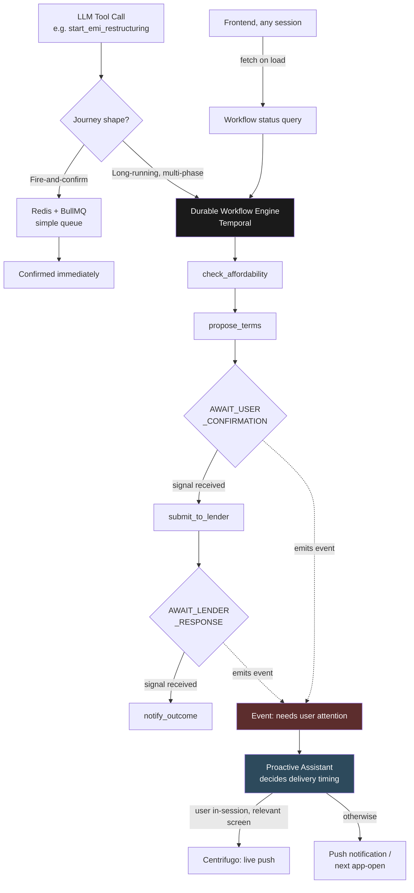

# Action Assistant — Architecture & Design Decisions
### One of four GoodScore AI Assistant role architectures

> **Thesis:** Correctness by construction, not by discipline. This is the only role that changes real money and real legal state — every decision here optimizes for a system that survives crashes, never double-executes, and never loses a user mid-process, without hand-rolled bookkeeping standing in for guarantees real infrastructure should provide.

---

## 1. Who this is for

The Action Assistant exists because **understanding a problem isn't the same as fixing it.** GoodScore's users don't just need to know they're about to miss an EMI — they need someone to actually negotiate the restructuring, file the dispute, or close the account, end to end.

| Journey | Shape | What Action Assistant does |
|---|---|---|
| 1. Set reminder / AutoPay | Single-step, instant | One API call, confirmed immediately |
| 2. Pay bill / EMI now | Single-step, money moves | Payment action with gateway confirmation; first journey where idempotency matters |
| 3. Raise a bureau dispute | Multi-step, external party, slow | File → awaiting bureau response → resolved, trackable over days/weeks |
| 4. Restructure an at-risk EMI | Multi-step, mid-flow confirmation, external party | Propose terms → user confirms → submit to lender → await response — the hardest journey in this role |
| 5. Apply for a loan | Multi-step, mid-flow confirmation, external party, regulatory | Eligibility → offer selection → KYC → submission → lender decision |
| 6. Close a loan / card | Multi-step, sometimes branches into a settlement | Direct closure if no balance, or forks into a Journey-4-style negotiation if one exists |

**The pattern:** these six journeys split into two genuinely different shapes — **fire-and-confirm** (1-2) and **long-running, multi-phase, sometimes-paused-for-a-human-or-an-external-party** (3-6). That split is the single fact every decision below is organized around.

---

## 2. The constraint that shaped every decision below

Every other role in this system has been shaped by GoodScore's real revenue ceiling. This role is shaped by something else first: **the cost of getting it wrong is not a bad user experience — it's corrupted financial state.**

```
A queue that loses track of a payment mid-retry:        risk of a double charge
A workflow that forgets a restructuring was in progress: risk of two conflicting
                                                            requests hitting the same lender
A screen pushed at the wrong moment:                      risk of interrupting an
                                                            unrelated task with financial anxiety
```

**This reframes the cost-discipline question that drove every other role.** It's not "what's the cheapest way to do this" — it's "what's the cheapest way to do this *without* re-implementing correctness guarantees by hand." As the decisions below show, building the cheap-looking option yourself is often the more expensive path once you count the engineering time spent rebuilding what production-grade infrastructure already solved.

---

## 3. System architecture



**Read this diagram once, remember three things:** (1) two infrastructure paths exist by design, routed by journey shape, not one path stretched to cover both; (2) a workflow never pushes a screen directly — it emits an event and Proactive decides delivery; (3) the workflow's own state is the single source of truth whether the user arrives via a live push or a cold app-open.

---

## 4. Six core decisions

Each shown with the alternative we seriously considered and rejected — because the "why not" is as important as the "what."

### Decision 1 — Real-time messaging: self-hosted Centrifugo, not bare-metal WebSockets or managed SaaS

| | Bare-metal WebSockets | Managed SaaS (Ably) | **Self-hosted Centrifugo** |
|---|---|---|---|
| Reliability at scale | 65% of DIY implementations hit significant downtime | High | High — purpose-built, benchmarked at 1M connections/server |
| Build cost | ~10.2 person-months in-house | None | Low — Docker-deployable |
| Cost at 5M MAU | Engineering + ops burden | ~10% of revenue (best case) to ~50%+ (standard rate) | Infra only, no per-user licensing |

**Rejected (both alternatives).** Bare-metal fails on reliability — this isn't a hypothetical risk, it's a documented majority-failure pattern. Managed SaaS fails on cost the same way every paid-API-at-scale option has failed elsewhere in this system.

**Verdict: self-hosted Centrifugo**, supporting both WebSocket and SSE transports from one server — shared infrastructure other roles can ride on, not an Action-Assistant-only cost.

### Decision 2 — Job queue vs. workflow engine: routed by journey shape, not one tool for both

| | Plain queue (BullMQ) for everything | **Queue for 1-2, durable engine (Temporal) for 3-6** |
|---|---|---|
| What a queue guarantees | Delivery, not completion — partial-failure recovery is hand-built | Queue handles what it's good at; engine handles multi-step survival |
| Multi-step crash recovery | Manual state tracking in Redis/DB, checked at every step | Built-in — workflow resumes exactly where it stopped |
| Engineering cost of "doing it cheap" | Rebuilding Temporal's guarantees by hand — more total effort, not less | One real infra decision, used correctly per shape |

**Rejected (one tool for everything).** A queue's contract stops at "a worker received this job" — it says nothing about whether a 6-phase restructuring workflow survived a crash on phase 3 without re-submitting to the lender. Treating that as a queue problem means hand-building exactly what a workflow engine already provides.

**Verdict: BullMQ for fire-and-confirm (Journeys 1-2); Temporal for long-running, multi-phase, externally-dependent processes (Journeys 3-6).**

### Decision 3 — Idempotency: two guarantees, not one ⚠️ *the sharpest call in this doc*

The instinct is that "an idempotency key" solves duplicate-request risk. It solves one of two distinct problems that both need solving.

| | Idempotency key alone | **Idempotency key + business-entity lock** |
|---|---|---|
| Catches a retried network request | Yes | Yes |
| Catches two *different*, individually valid restructuring requests for the same loan | No — different requests carry different keys | Yes — the lock is tied to the loan, not the request |

**Rejected (key alone).** A user submitting "restructure into 5 EMIs," then before that resolves, "actually, restructure into 3 EMIs" — both are well-formed, idempotent, individually correct requests. A key-only system lets both through. This is precisely the case that breaks trust: two conflicting negotiations reaching a lender for the same loan.

**Verdict: request-level idempotency keys on every state-changing call, plus a business-entity lock keyed to the loan/account itself.** In Temporal, this is nearly free — deriving the workflow ID from the loan ID means a second restructuring attempt for an already-active loan simply returns the existing workflow instead of starting a conflicting one.

### Decision 4 — Mid-workflow user input: durable signals, not a side-channel bolted onto a queue

| | Custom side-channel (poll a status table, build your own "wait for input" logic) | **Temporal signals** |
|---|---|---|
| Wait duration | Bounded by how the custom system is built | Identical mechanism for 5 seconds or 5 months |
| Compute while waiting | Whatever the custom polling loop costs | Zero — workflow is fully suspended |
| Where the screen-to-show logic lives | A frontend state machine that can drift from backend reality | The workflow's own state — single source of truth |

**Rejected (custom side-channel).** Building a bespoke "pause and wait for the user" mechanism duplicates what signals already do natively, and risks the frontend's idea of "what screen to show" silently diverging from the backend's actual state.

**Verdict: each multi-step journey is an explicit workflow definition with named phases**, where "show the user a screen" is a wait-for-signal step. The workflow's current phase is what the frontend renders against — not a separately maintained state machine.

### Decision 5 — Finding a paused request again: a backend entity, not a chat thread to scroll back into

| | Chat history as the resume mechanism | **Independent backend entity, addressable by loan/account ID** |
|---|---|---|
| User experience days later | Hunt through a multi-day-old conversation to find the right thread | Tap a notification, land directly on the relevant screen |
| Accessibility for the target user | Requires comfort scrolling/parsing chat history | Doesn't — the active request is always independently surfaced |

**Rejected (chat-as-source-of-truth).** GoodScore's users are already anxious about money and not always comfortable navigating a long chat scrollback. Making them re-find a two-day-old conversation to act on a time-sensitive financial request adds friction at exactly the wrong moment.

**Verdict: the long-running request is a first-class backend entity.** Chat is how it gets created; it is not how it gets resumed.

### Decision 6 — Screen delivery timing: hand off to Proactive, never push directly

| | Workflow pushes the screen directly when ready | **Workflow emits an event; Proactive decides delivery** |
|---|---|---|
| Risk if user is mid-task elsewhere | Yanks them out of an unrelated flow into a financial confirmation screen | Never happens — delivery always respects the user's current context |
| Who owns "when to interrupt" | Two roles independently making that judgment | One role (Proactive), consistently, system-wide |

**Rejected (direct push).** A user paying a bill or reviewing their report shouldn't be interrupted by an unrelated restructuring confirmation just because it became ready. Two different roles independently deciding when to interrupt the user risks inconsistent, occasionally jarring behavior.

**Verdict: Action Assistant produces events; Proactive Assistant owns all delivery-timing decisions, system-wide** — live push if in-session and relevant, otherwise a notification or next-app-open surfacing, exactly as already established for Proactive's own triggers.

---

## 5. Cost summary

| Component | Approach | Monthly cost | Cost shape |
|---|---|---|---|
| Real-time messaging | Self-hosted Centrifugo | Infra only, shared across roles | Fixed, not per-user |
| Fire-and-confirm jobs (Journeys 1-2) | Redis + BullMQ | Low, standard queue infra | Fixed |
| Long-running workflows (Journeys 3-6) | Self-hosted Temporal cluster | Real, ongoing infra + ops time | Fixed — scales with workflow *types* and engineering investment, not linearly with MAU |
| Idempotency / locking | Built into the workflow ID scheme | ~₹0 marginal | N/A |

**This role's cost story is different in shape from every other role in this system.** It's not a per-conversation or per-token cost to optimize against revenue — it's fixed infrastructure, justified once, by being the only sound way to handle money-moving, multi-party, must-not-corrupt-state workflows correctly.

---

## 6. What ships first

1. **Centrifugo messaging layer** — shared infrastructure; needed before any multi-step journey can deliver a live update
2. **Fire-and-confirm journeys (1-2)** — lowest risk, proves the simple path end to end on plain queue infrastructure
3. **Temporal cluster + one full multi-step workflow (Journey 4)** — the hardest journey first, since it exercises every pattern (mid-flow confirmation, external-party wait, locking) the others reuse
4. **Remaining long-running journeys (3, 5, 6)** — built on the same workflow patterns Journey 4 established
5. **Proactive hand-off integration** — wires workflow events into Proactive's existing delivery-timing logic

---

## 7. Open risks / what we're watching

- **Temporal operational overhead** is real and ongoing — cluster management, deterministic-workflow-code discipline, and team ramp-up are genuine costs not yet sized in detail
- **Lender API reliability** — Journeys 4-6 depend on external lender systems responding; workflow design assumes indefinite waits are fine, but lender-side SLAs and failure modes haven't been mapped
- **Workflow event-history limits** — long-running workflows with reminders/escalations have a bounded event history; needs validation that GoodScore's longest journeys (e.g., a slow bureau dispute) stay within safe limits
- **Proactive hand-off coupling** — Action Assistant now depends on Proactive's delivery logic being correct and timely; this cross-role dependency needs a clear contract so failures in one don't silently strand the other
